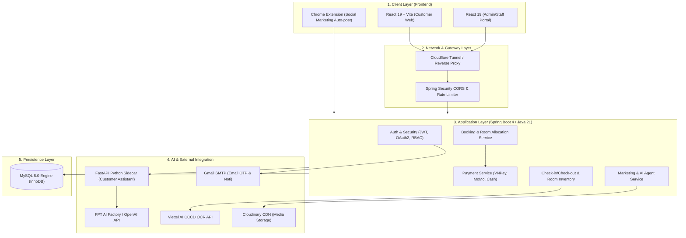
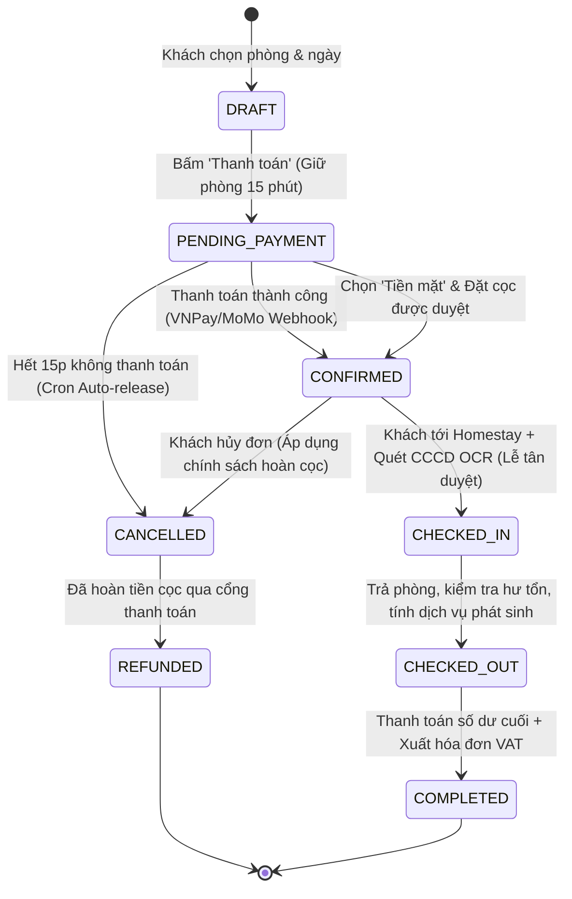
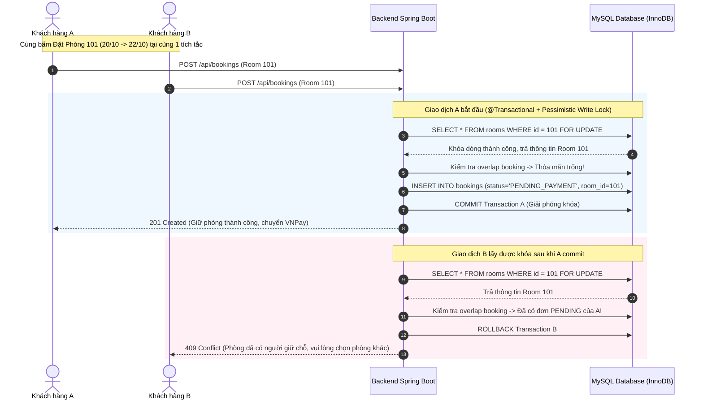
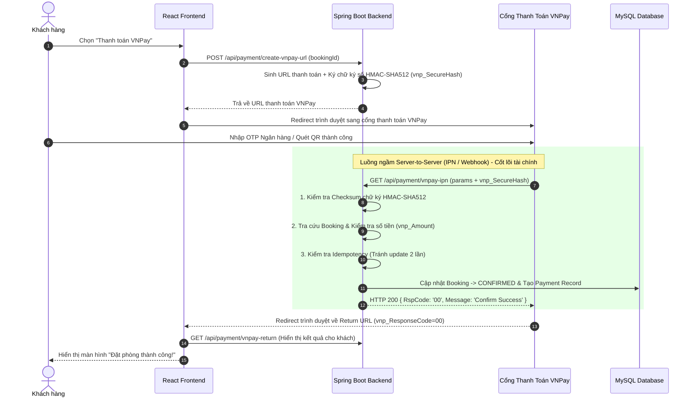
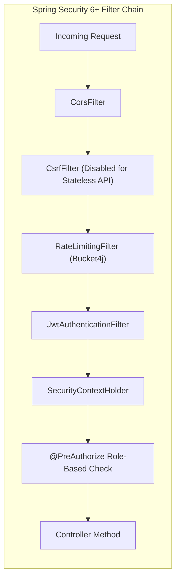
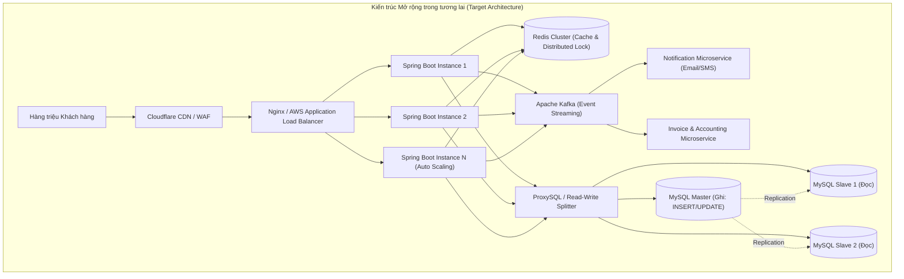

# BỘ 200 CÂU HỎI & ĐÁP ÁN VẤN ĐÁP BẢO VỆ ĐỒ ÁN TỐT NGHIỆP SEP490
## HỆ THỐNG QUẢN LÝ VÀ ĐẶT PHÒNG HOMESTAY (HOMESTAY MANAGEMENT SYSTEM)

---

## MỤC LỤC TỔNG QUAN

| Phần | Chủ đề chính | Số lượng câu hỏi |
|---|---|---|
| **PHẦN I** | **Kiến trúc Hệ thống, Công nghệ & Nguồn dữ liệu** | Câu 001 - 030 |
| **PHẦN II** | **Nghiệp vụ cốt lõi & Luồng vòng đời Đặt phòng - Check-in - Check-out** | Câu 031 - 065 |
| **PHẦN III** | **Thuật toán, Xử lý Đua tài nguyên (Concurrency) & Logic phức tạp** | Câu 066 - 095 |
| **PHẦN IV** | **Tích hợp Cổng Thanh toán (VNPay, MoMo) & Bảo mật Webhook/IPN** | Câu 096 - 120 |
| **PHẦN V** | **Trí tuệ nhân tạo (AI Chatbot, Viettel AI CCCD OCR & Social Marketing Agent)** | Câu 121 - 150 |
| **PHẦN VI** | **Bảo mật, Phân quyền (RBAC), Mã hóa & Chống tấn công** | Câu 151 - 175 |
| **PHẦN VII** | **Mở rộng, Tối ưu hiệu năng, Hạ tầng DevOps & Khả năng Scale** | Câu 176 - 200 |

---

## PHẦN I: KIẾN TRÚC HỆ THỐNG, CÔNG NGHỆ & NGUỒN DỮ LIỆU (Câu 001 - 030)



#### Câu 001: Trình bày tổng quan kiến trúc hệ thống của dự án?
- **Trả lời:** Hệ thống được thiết kế theo kiến trúc **Layered Monolith kết hợp AI Sidecar Micro-service**.
  - **Frontend:** React 19, Vite, TailwindCSS/Vanilla CSS, Axios, React Router Dom.
  - **Backend:** Spring Boot (Java 21), Spring Security + JWT, Spring Data JPA/Hibernate.
  - **Database:** MySQL 8.0 với engine InnoDB hỗ trợ ACID transaction.
  - **AI Sidecar:** Python FastAPI làm proxy/sidecar cho chatbot AI để xử lý streaming token và prompt context.
  - **Dịch vụ bên thứ ba:** VNPay/MoMo (Thanh toán), Viettel AI (OCR CCCD quét thông tin khách), Cloudinary (lưu ảnh), Gmail SMTP (gửi mã xác thực OTP).

#### Câu 002: Tại sao lại chọn Monolith cho Core Backend thay vì Microservices hoàn toàn?
- **Trả lời:**
  - Quy mô nghiệp vụ của Homestay đòi hỏi tính toàn vẹn dữ liệu cực kỳ chặt chẽ (Atomic Transaction) giữa giữ phòng, trừ tồn kho phòng, tạo hóa đơn và thanh toán.
  - Monolith giúp giảm độ trễ mạng (Network Latency), loại bỏ bài toán Distributed Transaction phức tạp (như 2PC hay Saga pattern) khi chưa cần thiết, dễ bảo trì, dễ deploy và kiểm thử toàn diện đối với quy mô đồ án tốt nghiệp chuẩn doanh nghiệp vừa và nhỏ.

#### Câu 003: Tại sao lại tách riêng dịch vụ Chatbot AI sang một Python FastAPI Sidecar mà không viết trực tiếp bằng Java Spring AI?
- **Trả lời:**
  - Hệ sinh thái Python sở hữu các thư viện AI/LLM, xử lý vector, LangChain và tương thích API LLM (FPT AI Factory, Ollama, HuggingFace) vượt trội và cập nhật nhanh hơn.
  - Tách sidecar giúp cô lập rủi ro: Nếu AI service bị timeout, quá tải RAM hoặc crash thì nghiệp vụ lõi (Đặt phòng, Thanh toán, Check-in) của Spring Boot vẫn hoạt động 100% bình thường.

#### Câu 004: Dự án sử dụng Java 21, hãy nêu những tính năng mới của Java 21 được áp dụng trong project?
- **Trả lời:**
  - **Virtual Threads (Project Loom):** Xử lý hàng nghìn request I/O-bound đồng thời (như gọi API ngân hàng, gửi email, gọi AI) với chi phí RAM cực thấp.
  - **Record Classes & Pattern Matching:** Giảm boilerplate code cho các DTO bất biến (Immutable Data Transfer Objects).
  - **Sequenced Collections:** Giúp truy xuất phần tử đầu/cuối của danh sách phòng/lịch trình trực quan hơn.

#### Câu 005: React 19 mang lại lợi ích gì cho Frontend của dự án so với các phiên bản React cũ?
- **Trả lời:**
  - Cơ chế **React Compiler** tự động tối ưu hóa re-render mà không cần lạm dụng `useMemo` và `useCallback`.
  - Hỗ trợ tốt hơn cho Server Actions, useOptimistic UI giúp cập nhật trạng thái đặt phòng mượt mà hơn trước khi server trả kết quả.

#### Câu 006: Mô hình CSDL (Database Schema) gồm bao nhiêu bảng chính? Liệt kê các quan hệ chủ chốt.
- **Trả lời:** CSDL gồm hơn 15 bảng chính:
  - `users`, `roles`, `user_roles`: Quản lý người dùng, phân quyền RBAC.
  - `homestays`, `rooms`, `room_types`, `room_images`: Quản lý thực thể homestay, phòng, tiện ích, ảnh.
  - `bookings`, `booking_details`, `booking_services`: Quản lý đơn đặt phòng, chi tiết phòng theo ngày, dịch vụ phụ kèm.
  - `payments`, `invoices`: Quản lý giao dịch thanh toán trực tuyến/tiền mặt và xuất hóa đơn.
  - `checkin_registrations`, `guest_profiles`: Lưu thông tin khách lưu trú, quét CCCD OCR.
  - `marketing_posts`, `ai_campaigns`: Lưu trữ nội dung và chiến dịch marketing tự động hóa.

#### Câu 007: Hãy giải thích cách thiết kế khóa ngoại và Index trong bảng `bookings` và `booking_details`?
- **Trả lời:**
  - `bookings`: Primary Key `id`, Foreign Key `user_id` liên kết `users(id)`. Có B-Tree Composite Index trên `(status, created_at)` để phục vụ cron job quét đơn quá hạn và báo cáo doanh thu.
  - `booking_details`: Primary Key `id`, Foreign Key `booking_id` liên kết `bookings(id)` và `room_id` liên kết `rooms(id)`. Có Index trên `(room_id, check_in_date, check_out_date, status)` để tăng tốc độ truy vấn kiểm tra phòng trống lên gấp 10-20 lần.

#### Câu 008: Dữ liệu hình ảnh Homestay/Phòng được lưu trữ như thế nào? Lưu URL hay Base64 trong database?
- **Trả lời:**
  - Dữ liệu hình ảnh được upload trực tiếp lên **Cloudinary CDN**.
  - Database chỉ lưu chuỗi URL an toàn (HTTPS Secure URL) và `public_id` của ảnh.
  - **Lý do:** Tuyệt đối không lưu Base64 hay binary BLOB trong DB vì sẽ làm phình dung lượng database, gây chậm I/O, khó backup và không tận dụng được cơ chế nén ảnh, CDN cache toàn cầu của Cloudinary.

#### Câu 009: Hệ thống gửi email OTP và xác nhận đơn đặt phòng bằng phương thức nào?
- **Trả lời:** Sử dụng **Spring Boot Starter Mail (JavaMailSender)** kết nối qua giao thức **Gmail SMTP (Port 587 TLS)**, kết hợp template HTML động (Thymeleaf/Freemarker) và xử lý bất đồng bộ `@Async` để không block luồng xử lý của khách hàng.

#### Câu 010: Giải thích quy trình xác thực Single Sign-On (SSO) qua Google OAuth2?
- **Trả lời:**
  1. Frontend gọi Google Identity Services SDK để khách chọn tài khoản Google -> Nhận về `id_token` (JWT).
  2. Frontend gửi `id_token` này về Backend API `POST /api/auth/google`.
  3. Backend dùng Google Token Verifier để verify chữ ký và hạn của token với Google Server.
  4. Backend trích xuất email, họ tên, avatar; kiểm tra nếu user chưa có trong DB thì tự động tạo tài khoản với role `CUSTOMER`, sau đó phát sinh cặp `Access Token` & `Refresh Token` riêng của hệ thống gửi về cho Frontend.

#### Câu 011: Dịch vụ OCR quét CCCD hoạt động ra sao? Nguồn API từ đâu?
- **Trả lời:**
  - Sử dụng API **Viettel AI CCCD OCR**.
  - Khi lễ tân hoặc khách tải ảnh mặt trước/sau CCCD lên giao diện Check-in, Backend gửi ảnh dạng multipart hoặc base64 kèm Auth Token tới Viettel AI Engine.
  - AI bóc tách thông tin: Số CCCD, Họ tên, Ngày sinh, Giới tính, Quê quán, Địa chỉ thường trú -> Trả JSON -> Hệ thống tự động map vào form `CheckInRegistration` giúp giảm 90% thời gian nhập tay.

#### Câu 012: LLM phục vụ AI Chatbot là model nào? Cách Backend giao tiếp với AI?
- **Trả lời:**
  - Sử dụng LLM của **FPT AI Factory / OpenAI compatible model**.
  - Backend Spring Boot nhận câu hỏi từ user -> Truy vấn DB để lấy context (danh sách phòng trống, bảng giá, quy định homestay) -> Ghép vào System Prompt (RAG dạng nhẹ) -> Gửi sang FastAPI Sidecar -> Gọi LLM -> Trả câu trả lời tư vấn chính xác về homestay.

#### Câu 013: Kiến trúc bảo mật tầng mạng được thiết lập như thế nào khi chạy môi trường thực tế?
- **Trả lời:**
  - Sử dụng **Cloudflare Tunnel / Reverse Proxy** để expose dịch vụ mà không cần mở port public router.
  - Cloudflare đảm bảo HTTPS SSL/TLS end-to-end, lọc DDoS tầng 3, 4, 7 và áp dụng Web Application Firewall (WAF).
  - Tầng Backend áp dụng Spring Security CORS Whitelist chỉ cho phép domain Frontend truy cập.

#### Câu 014: Tại sao trong source code có thư mục Chrome Extension (`lado-tiktok-extension`, `lado-social-extension`)?
- **Trả lời:**
  - Đây là giải pháp sáng tạo cho module **AI Marketing Automation**: Do API chính thức của TikTok/Facebook yêu cầu doanh nghiệp xác minh phức tạp, nhóm xây dựng Chrome Extension đóng vai trò "Bridge" lấy nội dung bài đăng đã được AI sinh từ backend để tự động fill vào giao diện Creator Studio của nền tảng mạng xã hội.

#### Câu 015: Điểm khác biệt giữa kiến trúc DTO và Entity trong hệ thống là gì?
- **Trả lời:**
  - **Entity:** Ánh xạ trực tiếp với bảng trong CSDL thông qua JPA/Hibernate, chứa các ràng buộc DB.
  - **DTO (Data Transfer Object):** Chỉ đóng gói dữ liệu cần thiết cho từng API cụ thể (Request/Response). Giúp ngăn chặn lỗi lộ thông tin nhạy cảm (như Password Hash, Token), tránh lỗi đệ quy tuần hoàn (Infinite Circular Reference do `@ManyToOne`/`@OneToMany`) và tăng tính bao đóng.

#### Câu 016: Dependency Injection và Inversion of Control (IoC) trong Spring Boot hoạt động như thế nào trong project?
- **Trả lời:** Spring IoC Container tự động quản lý vòng đời (Lifecycle) và khởi tạo các `@Service`, `@Repository`, `@Component`, `@Controller`. Khi một Controller cần Service, ta inject qua **Constructor Injection** (`@RequiredArgsConstructor` của Lombok) giúp code lỏng lẻo (loose coupling), dễ viết Unit Test với Mockito.

#### Câu 017: ORM Hibernate đóng vai trò gì và dự án cấu hình `spring.jpa.hibernate.ddl-auto` như thế nào?
- **Trả lời:** Hibernate là ORM mapping giữa Java Object và SQL Relational Tables. Trong môi trường Development dùng `update` hoặc `validate`. Trong môi trường Production luôn cấu hình `validate` hoặc `none`, kết hợp migration script SQL độc lập để đảm bảo an toàn tuyệt đối cho dữ liệu thật.

#### Câu 018: Quy chuẩn thiết kế RESTful API trong dự án được thể hiện qua những quy tắc nào?
- **Trả lời:**
  - Sử dụng đúng HTTP Methods: `GET` (đọc), `POST` (tạo mới), `PUT` (cập nhật toàn bộ), `PATCH` (cập nhật một phần), `DELETE` (xóa mềm/cứng).
  - Danh từ số nhiều làm Resource Path: `/api/v1/rooms`, `/api/v1/bookings`.
  - Chuẩn hóa HTTP Status Code: `200 OK`, `201 Created`, `400 Bad Request`, `401 Unauthorized`, `403 Forbidden`, `404 Not Found`, `409 Conflict`, `500 Internal Server Error`.
  - Format Response đồng nhất với `ApiResponse<T>`: `{ success: boolean, message: string, data: T, timestamp: string }`.

#### Câu 019: Hệ thống xử lý Logging như thế nào để phục vụ việc truy vết lỗi?
- **Trả lời:** Sử dụng **SLF4J + Logback**. Định dạng log chuẩn gồm Timestamp, Thread Name, Log Level (INFO, WARN, ERROR), Class Name và Correlation ID (hoặc Request ID). Các thao tác tài chính, thanh toán, login thất bại đều được log mức WARN/ERROR ra file riêng biệt để phục vụ audit.

#### Câu 020: Quá trình build và đóng gói Backend & Frontend diễn ra như thế nào?
- **Trả lời:**
  - **Backend:** Dùng Apache Maven (`mvn clean package -DskipTests=false`) tạo ra file `.jar` độc lập chứa nhúng Tomcat Server.
  - **Frontend:** Dùng Vite (`npm run build`) biên dịch TypeScript/JSX, tree-shaking và minify ra các static assets HTML, CSS, JS trong thư mục `dist/`.

#### Câu 021: Cơ chế Hot-Reload trong quá trình phát triển được cấu hình ra sao?
- **Trả lời:** Frontend sử dụng Vite HMR (Hot Module Replacement) cập nhật UI trong vài mili-giây. Backend sử dụng `spring-boot-devtools` tự động reload context khi bytecode thay đổi.

#### Câu 022: Dự án quản lý biến môi trường (Environment Variables) như thế nào để không bị lộ Secret Key?
- **Trả lời:** Không hardcode API key vào git repo. Sử dụng file `.env` cho Frontend (tiền tố `VITE_`) và `application-local.properties` / OS Environment Variables cho Backend (chứa `DB_PASSWORD`, `JWT_SECRET`, `VNPAY_HASH_SECRET`). File cấu hình mẫu được lưu dưới dạng `.env.example` và đưa file chứa credential thật vào `.gitignore`.

#### Câu 023: Axios Interceptor trong React Frontend được sử dụng vào mục đích gì?
- **Trả lời:**
  - **Request Interceptor:** Tự động lấy JWT token từ LocalStorage/Cookie gắn vào Header `Authorization: Bearer <token>` trước khi gửi bất kỳ request nào.
  - **Response Interceptor:** Bắt mã lỗi tập trung. Nếu nhận `401 Unauthorized`, tự động kích hoạt luồng Refresh Token hoặc logout chuyển hướng user về trang Login; nếu nhận `403 Forbidden` thì báo Toast cảnh báo không đủ quyền.

#### Câu 024: Cách cấu hình CORS (Cross-Origin Resource Sharing) chuẩn trong Spring Boot?
- **Trả lời:** Cấu hình bằng `CorsConfigurationSource` trong `SecurityFilterChain`. Chỉ định rõ `allowedOrigins` (vd: `http://localhost:5173`, domain deploy thật), `allowedMethods` (`GET`, `POST`, `PUT`, `DELETE`, `OPTIONS`), `allowedHeaders` (`*`), `allowCredentials(true)` và đặt `maxAge(3600)` để cache preflight request.

#### Câu 025: Lợi ích của việc sử dụng Connection Pool (HikariCP) mặc định trong Spring Boot?
- **Trả lời:** HikariCP tái sử dụng các kết nối DB đã mở sẵn thay vì khởi tạo kết nối TCP mới mỗi khi có query. Điều này giảm thiểu overhead kết nối, giới hạn số lượng kết nối tối đa (`maximumPoolSize=20`) tránh làm sập MySQL khi tải tăng đột biến.

#### Câu 026: Tại sao lại chọn MySQL InnoDB thay vì MyISAM?
- **Trả lời:** InnoDB hỗ trợ chuẩn **ACID**, ràng buộc khóa ngoại (Foreign Key Constraints), khóa mức dòng (**Row-level locking**) và cơ chế Crash Recovery qua Redo Log. Ngược lại, MyISAM chỉ hỗ trợ khóa toàn bảng (Table-level lock), rất dễ gây tắc nghẽn khi có nhiều giao dịch đặt phòng cùng lúc.

#### Câu 027: Kiến trúc phân tầng (Tiered Layer) trong Backend Spring Boot gồm những tầng nào và luồng dữ liệu đi ra sao?
- **Trả lời:**
  1. `Controller Layer`: Nhận HTTP Request, validate DTO đầu vào, gọi Service.
  2. `Service Layer`: Chứa nghiệp vụ kinh doanh (Business Logic), điều phối các Transaction (`@Transactional`).
  3. `Repository Layer`: Giao tiếp CSDL thông qua Spring Data JPA/Hibernate.
  4. `Entity Layer`: Đại diện cho các bảng CSDL.
  5. `Database (MySQL)`: Lưu trữ dữ liệu vật lý.

#### Câu 028: Dự án sử dụng công cụ gì để test API và quản lý tài liệu API?
- **Trả lời:** Sử dụng Swagger / OpenAPI 3.0 (`springdoc-openapi-starter-webmvc-ui`) tạo giao diện web UI tại `/swagger-ui/index.html` cho phép xem schema DTO và gọi test trực tiếp, kết hợp Postman Collection cho các test case chuỗi nghiệp vụ.

#### Câu 029: Tốc độ render của Vite nhanh hơn Webpack ở điểm cốt lõi nào?
- **Trả lời:** Vite tận dụng native ES Modules (ESM) của trình duyệt hiện đại trong chế độ dev và dùng esbuild viết bằng Go (nhanh hơn JS 10-100 lần) để pre-bundle dependencies, không cần bundle toàn bộ ứng dụng trước khi khởi động như Webpack.

#### Câu 030: Hãy nêu 3 quyết định kỹ thuật (Technical Decisions) quan trọng nhất của nhóm trong dự án này?
- **Trả lời:**
  1. Sử dụng cơ chế khóa phân tán/bi quan kết hợp trạng thái `HOLD` có thời hạn (TTL) để giải quyết triệt để bài toán Double Booking.
  2. Tích hợp AI OCR Viettel trực tiếp vào quy trình Check-in số hóa, biến quy trình lễ tân truyền thống thành eKYC tự động.
  3. Kiến trúc bảo mật Webhook thanh toán đa tầng (Chữ ký HMAC-SHA512 + Khóa Idempotency + Xác thực số tiền) đảm bảo an toàn tuyệt đối cho tài chính.

---

## PHẦN II: NGHIỆP VỤ CỐT LÕI & LUỒNG ĐẶT PHÒNG - CHECK-IN - CHECK-OUT (Câu 031 - 065)



#### Câu 031: Trình bày toàn bộ State Machine (Các trạng thái) của một đơn Booking từ khi tạo đến kết thúc?
- **Trả lời:**
  - `PENDING_PAYMENT`: Đơn mới tạo, đang giữ chỗ tạm thời (TTL 15 phút).
  - `CONFIRMED`: Đã thanh toán trực tuyến thành công hoặc được lễ tân xác nhận đặt cọc.
  - `CHECKED_IN`: Khách đã đến, lễ tân quét CCCD OCR và bàn giao chìa khóa phòng.
  - `CHECKED_OUT`: Khách trả phòng, nhân viên dọn phòng kiểm tra tài sản.
  - `COMPLETED`: Đã thanh toán toàn bộ chi phí phát sinh, hóa đơn hoàn tất.
  - `CANCELLED`: Đơn bị hủy do khách chủ động, hoặc do quá hạn 15 phút không thanh toán.
  - `REFUNDED`: Đã hoàn tiền đặt cọc theo chính sách hủy phòng.

#### Câu 032: Khách hàng tìm kiếm phòng trống theo ngày như thế nào? Thuật toán kiểm tra phòng trống là gì?
- **Trả lời:**
  - Khách chọn `checkInDate`, `checkOutDate` và số lượng khách.
  - Backend thực hiện loại trừ tất cả các phòng có đơn booking nằm trong trạng thái `CONFIRMED`, `CHECKED_IN`, hoặc `PENDING_PAYMENT` (chưa hết hạn) mà có khoảng thời gian giao cắt (Overlap).
  - **Điều kiện Overlap:** `(BookingCheckIn < SearchCheckOut) AND (BookingCheckOut > SearchCheckIn)`.
  - Những phòng không thỏa mãn điều kiện giao cắt trên chính là phòng trống khả dụng.

#### Câu 033: Giải thích tại sao điều kiện giao cắt ngày lại là `(A < D) AND (B > C)` thay vì dùng phép so sánh `BETWEEN`?
- **Trả lời:**
  - `BETWEEN` chỉ bắt được các trường hợp điểm mút nằm trong khoảng, dễ bỏ sót trường hợp khoảng ngày đặt phòng bao trùm toàn bộ khoảng ngày tìm kiếm (Search range nằm hoàn toàn bên trong Booking range).
  - Công thức `(BookingStart < UserEnd) AND (BookingEnd > UserStart)` là công thức toán học chuẩn xác 100% để phát hiện mọi trường hợp giao nhau giữa 2 khoảng thời gian: Giao đầu, giao đuôi, bao trùm hoặc trùng khớp hoàn toàn.

#### Câu 034: Hệ thống giải quyết bài toán "Giữ phòng tạm thời" (Room Hold) như thế nào khi khách đang chuyển sang trang VNPay/MoMo?
- **Trả lời:**
  - Khi khách nhấn "Tiến hành thanh toán", hệ thống tạo đơn với trạng thái `PENDING_PAYMENT` và lưu mốc `hold_expires_at = NOW() + 15 phút`.
  - Trong thời gian 15 phút này, phòng đó được coi là "đã bận" đối với các khách hàng khác đang tìm kiếm.
  - Một Scheduled Cron Job chạy ngầm mỗi 1 phút quét CSDL: Nếu đơn `PENDING_PAYMENT` có `NOW() > hold_expires_at`, hệ thống tự động đổi trạng thái sang `CANCELLED` và giải phóng phòng ngay lập tức.

#### Câu 035: Quy trình Check-in thực tế diễn ra như thế nào trên phần mềm?
- **Trả lời:**
  1. Khách đọc mã Booking Code hoặc Số điện thoại/Tên.
  2. Lễ tân tra cứu đơn trên giao diện Admin/Staff.
  3. Lễ tân chụp/tải ảnh mặt trước và sau CCCD của khách.
  4. Hệ thống gọi Viettel AI OCR trích xuất thông tin và điền tự động vào phiếu lưu trú `CheckInRegistration`.
  5. Lễ tân kiểm tra lại, chọn số phòng thực tế bàn giao và nhấn **"Xác nhận Check-in"**.
  6. Trạng thái đơn chuyển sang `CHECKED_IN`, phòng chuyển sang màu xanh đậm (Đang có khách) trên Room Matrix Calendar.

#### Câu 036: Hệ thống hỗ trợ những hình thức thanh toán nào?
- **Trả lời:**
  1. **Thanh toán trực tuyến:** VNPay (Thẻ ATM nội địa, QR Pay, Thẻ quốc tế Visa/Mastercard).
  2. **Ví điện tử:** MoMo QR Code & Deep-link.
  3. **Tiền mặt / Chuyển khoản trực tiếp:** Thanh toán tại quầy khi check-in hoặc đặt cọc trước với lễ tân.

#### Câu 037: Chính sách đặt cọc (Deposit) của hệ thống được quy định như thế nào?
- **Trả lời:**
  - Khách hàng có thể lựa chọn:
    - **Thanh toán toàn bộ (100%)**: Xác nhận đơn ngay lập tức.
    - **Đặt cọc tối thiểu (30% hoặc 50% tổng giá trị đơn)**: Giữ phòng thành công, số tiền còn lại sẽ thanh toán khi Check-in hoặc Check-out.
  - Phần trăm cọc được cấu hình linh hoạt trong hệ thống quản trị (`homestay_settings`).

#### Câu 038: Quy trình Hủy phòng và Hoàn tiền (Cancellation & Refund) hoạt động ra sao?
- **Trả lời:**
  - Nếu khách hủy trước ngày Check-in `>= 3 ngày`: Hoàn 100% tiền cọc.
  - Nếu khách hủy trước ngày Check-in `từ 1 đến 3 ngày`: Hoàn 50% tiền cọc.
  - Nếu khách hủy trong vòng `24 giờ` trước giờ Check-in: Phạt 100% tiền cọc (Không hoàn lại).
  - Khi hủy thành công, hệ thống gửi lệnh Refund API tới cổng VNPay/MoMo hoặc tạo phiếu hoàn tiền cho thủ quỹ.

#### Câu 039: Quy trình Check-out và Tính chi phí phát sinh diễn ra như thế nào?
- **Trả lời:**
  1. Khách yêu cầu trả phòng.
  2. Nhân viên buồng phòng kiểm tra phòng và cập nhật danh sách sử dụng: Minibar, nước uống, đồ ăn vặt, dịch vụ thuê xe máy, giặt ủi, hoặc bồi thường thiệt hại tài sản (nếu làm vỡ/hỏng).
  3. Lễ tân nhập các khoản phụ phí vào đơn booking.
  4. Hệ thống tự động tính: `Tổng cần thu = Tiền phòng + Phụ phí dịch vụ - Tiền đã thanh toán trước (Cọc)`.
  5. Khách thanh toán số dư -> Lễ tân bấm **"Hoàn tất Check-out"** -> Hệ thống in hóa đơn PDF và chuyển phòng sang trạng thái `NEED_CLEANING` (Cần dọn dẹp).

#### Câu 040: Khi phòng chuyển sang `NEED_CLEANING`, luồng quản lý buồng phòng hoạt động ra sao?
- **Trả lời:**
  - Giao diện Housekeeping của nhân viên dọn phòng hiển thị danh sách phòng cần dọn.
  - Nhân viên dọn phòng nhận nhiệm vụ, thay ga gối, vệ sinh -> Bấm **"Bắt đầu dọn"** (`CLEANING_IN_PROGRESS`).
  - Dọn xong, nhân viên bấm **"Dọn hoàn tất"** -> Phòng chuyển sang `AVAILABLE` (Sẵn sàng đón khách mới) trên hệ thống tìm kiếm.

#### Câu 041: Nếu khách muốn đổi phòng (Room Change) giữa chừng khi đang ở thì hệ thống xử lý như thế nào?
- **Trả lời:**
  - Lễ tân kiểm tra phòng mới có trống trong khoảng thời gian còn lại của đơn hay không.
  - Nếu trống, hệ thống cập nhật `room_id` mới trong `booking_details`, tính toán lại tiền chênh lệch giá phòng (nếu phòng mới có hạng giá cao/thấp hơn) và ghi vết lịch sử đổi phòng trong nhật ký hệ thống (`audit_logs`).

#### Câu 042: Hệ thống xử lý trường hợp khách Check-in sớm hoặc Check-out muộn như thế nào?
- **Trả lời:**
  - Cấu hình chuẩn: Check-in lúc `14:00`, Check-out lúc `12:00`.
  - **Check-in sớm (Early Check-in):**
    - Từ 06:00 - 09:00: Phụ thu 50% giá ngày.
    - Từ 09:00 - 14:00: Phụ thu 30% giá ngày (nếu phòng có sẵn).
  - **Check-out muộn (Late Check-out):**
    - Từ 12:00 - 15:00: Phụ thu 30% giá ngày.
    - Từ 15:00 - 18:00: Phụ thu 50% giá ngày.
    - Sau 18:00: Tính 100% giá ngày.
  - Các mức phụ thu được tự động tính vào hóa đơn khi lễ tân chọn checkbox Check-in sớm / Check-out muộn.

#### Câu 043: Khi một đơn phòng đặt cho nhiều người nhưng đến khác giờ nhau, hệ thống ghi nhận khách lưu trú ra sao?
- **Trả lời:** Mỗi `Booking` có quan hệ 1-Nhiều với bảng `guest_profiles` (Danh sách khách lưu trú). Lễ tân có thể quét CCCD và thêm hồ sơ từng khách vào đơn bất kỳ lúc nào trong suốt thời gian lưu trú mà không làm gián đoạn trạng thái đơn.

#### Câu 044: Khách hàng đánh giá (Review/Rating) homestay như thế nào? Điều kiện để được đánh giá là gì?
- **Trả lời:**
  - **Điều kiện:** Chỉ những tài khoản có đơn booking ở trạng thái `COMPLETED` mới được quyền gửi đánh giá (tránh tình trạng spam đánh giá ảo/đối thủ cạnh tranh phá hoại).
  - Đánh giá gồm: Số sao (1-5 sao), bình luận văn bản, hình ảnh trải nghiệm. Điểm đánh giá trung bình của Homestay/Phòng sẽ được tự động tính toán lại bằng trigger/service.

#### Câu 045: Hệ thống có hỗ trợ tính năng Khuyến mãi / Mã giảm giá (Coupon/Voucher) không?
- **Trả lời:** Có. Bảng `coupons` lưu: Mã code, loại giảm (`PERCENTAGE` hoặc `FIXED_AMOUNT`), giá trị giảm, giá trị đơn hàng tối thiểu, mức giảm tối đa, ngày bắt đầu, ngày hết hạn và số lượt sử dụng tối đa. Khi khách nhập mã, backend kiểm tra tính hợp lệ và trừ trực tiếp vào tổng tiền trước khi tạo giao dịch thanh toán.

#### Câu 046: Một Homestay có thể có nhiều loại phòng (Room Types) và nhiều phòng cụ thể (Rooms) không?
- **Trả lời:** Đúng.
  - `RoomType`: Đại diện cho hạng phòng (vd: Phòng VIP Seaview, Phòng Deluxe Giường Đôi, Phòng Dorm 6 giường) chứa mô tả, diện tích, sức chứa tối đa và giá gốc.
  - `Room`: Đại diện cho phòng vật lý cụ thể (vd: Phòng 101, Phòng 102, Phòng 201) gắn với một `RoomType` cụ thể. Khách đặt theo `RoomType` hoặc chọn trực tiếp `Room` tùy cấu hình.

#### Câu 047: Tính năng Room Matrix Calendar (Sơ đồ lịch phòng) giải quyết vấn đề gì cho lễ tân?
- **Trả lời:** Cung cấp giao diện trực quan dạng lưới 2 chiều (Trục dọc: Danh sách phòng; Trục ngang: Các ngày trong tháng). Các ô hiển thị thanh trạng thái màu sắc: Vàng (`PENDING_PAYMENT`), Xanh lá (`CONFIRMED`), Xanh dương (`CHECKED_IN`), Xám (`MAINTENANCE`). Lễ tân có thể xem nhanh tình trạng lấp đầy phòng (Occupancy Rate), click vào thanh để xem chi tiết hoặc kéo thả điều chuyển phòng nhanh chóng.

#### Câu 048: Hệ thống quản lý các dịch vụ đi kèm (Additional Services) như thế nào?
- **Trả lời:** Có bảng danh mục dịch vụ `services` (Thuê xe máy theo ngày, BBQ sân vườn, Giặt sấy, Bữa sáng buffet...). Khi khách đặt phòng hoặc trong lúc lưu trú, lễ tân thêm dịch vụ vào đơn booking (`booking_services`), hệ thống tự động cộng dồn vào hóa đơn thanh toán cuối cùng.

#### Câu 049: Nếu khách làm hỏng tài sản trong phòng thì xử lý thế nào trong hệ thống?
- **Trả lời:** Hệ thống có danh mục tài sản và đơn giá đền bù trong phòng (`room_assets`). Khi check-out, nếu có hư hỏng, lễ tân chọn tài sản bị hỏng, số lượng, hệ thống tạo bản ghi phụ phí bồi thường và in rõ trong bảng kê hóa đơn để đối soát minh bạch với khách.

#### Câu 050: Làm thế nào hệ thống ngăn chặn việc khách đặt quá số lượng người cho phép của một phòng?
- **Trả lời:** Mỗi `RoomType` có cấu hình `max_adults`, `max_children` và `max_guests`. Khi khách chọn số người ở bộ lọc hoặc form đặt phòng, Backend validate: Nếu `adults + children > max_guests` sẽ trả về lỗi `400 Bad Request` kèm thông báo gợi ý đặt thêm phòng hoặc chọn hạng phòng lớn hơn.

#### Câu 051: Khi khách đặt combo nhiều phòng trong cùng 1 đơn booking thì CSDL lưu trữ thế nào?
- **Trả lời:** Bảng `bookings` đóng vai trò là Master Header (Lưu mã đơn, thông tin khách, tổng tiền, trạng thái chung). Bảng `booking_details` đóng vai trò Detail Lines (Mỗi dòng lưu một `room_id`, giá phòng tại thời điểm đặt, ngày check-in/check-out của phòng đó). Toàn bộ được thực thi trong một Database Transaction duy nhất.

#### Câu 052: Tại sao giá phòng lại được lưu trực tiếp vào bảng `booking_details` mà không lấy động từ bảng `rooms`?
- **Trả lời:** Đây là nguyên tắc **bất biến dữ liệu lịch sử (Historical Data Immutability)** trong thương mại điện tử. Giá phòng trong bảng `rooms` có thể tăng giảm theo mùa hoặc thay đổi theo thời gian. Khi khách đã đặt phòng ở mức giá 500.000 VNĐ, giá trong `booking_details` phải được chốt cứng (Snapshot Price) để không bị thay đổi khi chủ nhà sửa giá phòng trong tương lai.

#### Câu 053: Giá phòng linh hoạt (Dynamic Pricing) theo ngày trong tuần / cuối tuần / ngày lễ được áp dụng ra sao?
- **Trả lời:** Hệ thống có bảng `price_modifiers` hoặc `room_seasonal_prices`. Khi tính tổng tiền đơn phòng qua nhiều ngày, backend lặp qua từng ngày trong khoảng lưu trú: Ngày thường áp dụng giá gốc, thứ 6/thứ 7 cộng thêm % cuối tuần, ngày lễ tết (định nghĩa trong bảng ngày lễ) áp dụng mức giá đặc biệt, sau đó cộng tổng lại.

#### Câu 054: Làm sao để đảm bảo khách không thể đặt phòng trong quá khứ?
- **Trả lời:** Áp dụng cả 2 tầng kiểm tra:
  - **Frontend:** Giới hạn thuộc tính `min` của thẻ DatePicker bằng ngày hiện tại (`new Date().toISOString().split('T')[0]`).
  - **Backend Validation:** Sử dụng Bean Validation `@FutureOrPresent` trên trường `checkInDate` của Request DTO kết hợp custom validator: `checkOutDate.isAfter(checkInDate)`.

#### Câu 055: Sau khi khách đặt phòng thành công, hệ thống gửi thông tin gì qua email xác nhận?
- **Trả lời:** Email HTML chứa: Mã đặt phòng (Booking Code), Mã QR Code để quét check-in nhanh, Tên khách hàng, Tên phòng/Homestay, Địa chỉ chính xác và link Google Maps, Thời gian Check-in/Check-out, Số tiền đã thanh toán, Số tiền còn thiếu, Quy định lưu trú và Hotline hỗ trợ.

#### Câu 056: Hóa đơn điện tử (Invoice) được tạo ra khi nào và gồm những thông tin gì?
- **Trả lời:** Hóa đơn được tạo khi đơn chuyển sang `COMPLETED`. Gồm: Mã hóa đơn duy nhất (vd: `INV-20260923-001`), Ngày lập, Thông tin đơn vị Homestay (Mã số thuế, địa chỉ), Thông tin khách hàng, Bảng chi tiết tiền phòng + dịch vụ phụ phát sinh, Thuế VAT (nếu có), Giảm giá coupon, Tổng tiền thanh toán và phương thức đã trả.

#### Câu 057: Khách nước ngoài có thể đặt phòng và check-in trên hệ thống được không?
- **Trả lời:** Được. Hệ thống hỗ trợ đa dạng loại giấy tờ tùy thân (`PASSPORT`, `CCCD`, `CMND`). Khi check-in khách quốc tế, lễ tân chọn loại `PASSPORT` và nhập Số hộ chiếu, Quốc tịch.

#### Câu 058: Khách hàng có thể gia hạn thời gian lưu trú (Extend Stay) khi đang ở không?
- **Trả lời:** Có. Lễ tân thực hiện thao tác "Gia hạn lưu trú": Hệ thống kiểm tra xem từ ngày check-out cũ đến ngày check-out mới phòng đó có bị khách khác đặt trước không. Nếu không, cập nhật `check_out_date` mới, tính thêm tiền phòng phát sinh vào hóa đơn.

#### Câu 059: Điểm khác nhau giữa "Hủy đơn có hoàn cọc" và "Hủy đơn không hoàn cọc" trên hệ thống?
- **Trả lời:**
  - Cả hai đều giải phóng phòng về trạng thái trống.
  - Hủy có hoàn cọc: Sinh bản ghi giao dịch hoàn tiền trong bảng `payments` với số tiền âm, gọi API hoàn tiền sang cổng thanh toán.
  - Hủy không hoàn cọc: Tiền cọc được kết chuyển sang tài khoản doanh thu bồi thường vi phạm hợp đồng (`penalty_revenue`).

#### Câu 060: Báo cáo thống kê (Dashboard Analytics) cung cấp những chỉ số nào cho chủ Homestay?
- **Trả lời:**
  - **RevPAR (Revenue Per Available Room):** Doanh thu trên mỗi phòng khả dụng.
  - **ADR (Average Daily Rate):** Giá bán phòng trung bình mỗi ngày.
  - **Occupancy Rate (Tỷ lệ lấp đầy phòng):** `(Số đêm phòng đã bán / Tổng số đêm phòng có thể bán) * 100%`.
  - Biểu đồ doanh thu theo ngày/tháng/năm, nguồn khách (Trực tiếp, Marketing AI, Google), danh sách dịch vụ phụ mang lại doanh thu cao nhất.

#### Câu 061: Tính năng Maintenance (Bảo trì phòng) được quản lý như thế nào?
- **Trả lời:** Admin/Quản lý có thể tạo lịch khóa phòng bảo trì (Sửa điều hòa, sơn lại phòng, sửa điện nước) từ ngày A đến ngày B. Trong khoảng thời gian này, phòng sẽ ở trạng thái `MAINTENANCE` và bị loại hoàn toàn khỏi kết quả tìm kiếm của khách hàng.

#### Câu 062: Nếu khách làm mất chìa khóa phòng hoặc thẻ từ thì quy trình trên hệ thống là gì?
- **Trả lời:** Lễ tân chọn chức năng "Phụ phí phát sinh" -> Chọn mục "Làm mất chìa khóa/Thẻ từ" từ danh mục phụ phí với đơn giá cố định (vd: 100.000 VNĐ) để ghi nhận vào hóa đơn thanh toán khi check-out.

#### Câu 063: Hệ thống lưu vết ai là người thực hiện Check-in / Check-out như thế nào?
- **Trả lời:** Trong các bảng `bookings`, `invoices`, `checkin_registrations` đều có các trường audit: `created_by`, `updated_by`, `checked_in_by_user_id`, `checked_out_by_user_id` gắn với ID của nhân viên đang đăng nhập.

#### Câu 064: Hệ thống giải quyết thế nào nếu khách đặt phòng cho công ty cần xuất hóa đơn đỏ (VAT)?
- **Trả lời:** Trong form đặt phòng có tùy chọn "Yêu cầu xuất hóa đơn công ty": Khách điền Tên công ty, Mã số thuế, Địa chỉ công ty và Email nhận hóa đơn điện tử. Thông tin này được lưu vào bảng `booking_company_invoices` để kế toán xuất hóa đơn điện tử chính thức.

#### Câu 065: Quy trình bàn giao ca (Shift Handover) giữa các lễ tân có được hỗ trợ không?
- **Trả lời:** Có. Báo cáo ca làm việc tổng kết: Số tiền mặt thực tế đã thu trong ca, số tiền chuyển khoản qua QR, số đơn đã check-in, số đơn đã check-out, và danh sách các phòng cần lưu ý đặc biệt cho ca tiếp theo.

---

## PHẦN III: THUẬT TOÁN, CONCURRENCY & XỬ LÝ LOGIC CỐT LÕI (Câu 066 - 095)



#### Câu 066: Trình bày chi tiết bài toán "Double Booking" (Tranh chấp phòng) và cách giải quyết trong dự án?
- **Trả lời:**
  - **Vấn đề:** 2 khách hàng A và B cùng tìm thấy phòng 101 trống trong cùng một khoảng ngày và cùng nhấn nút "Đặt phòng" tại cùng một mili-giây. Nếu không xử lý, cả 2 đơn đều tạo thành công -> Xảy ra tình trạng 1 phòng bán cho 2 người.
  - **Giải pháp của dự án:** Kết hợp **Database Transaction `@Transactional`** với **Pessimistic Locking (Khóa bi quan)**:
    ```sql
    SELECT * FROM rooms WHERE id = :roomId FOR UPDATE;
    ```
    Khi giao dịch của Khách A chạy, câu lệnh `FOR UPDATE` khóa dòng của phòng 101 lại. Giao dịch của Khách B phải xếp hàng chờ. Giao dịch A kiểm tra thấy phòng trống -> Insert đơn booking -> Commit và nhả khóa. Giao dịch B sau đó được thực thi -> Kiểm tra overlap thấy đã có đơn của A -> Ném ra ngoại lệ `RoomAlreadyBookedException` và trả về mã lỗi HTTP `409 Conflict` báo cho khách B biết phòng vừa có người giữ chỗ.

#### Câu 067: Phân biệt Optimistic Locking (@Version) và Pessimistic Locking (FOR UPDATE)? Tại sao chọn Pessimistic Lock cho việc giữ phòng?
- **Trả lời:**
  - **Optimistic Locking:** Dùng cột `@Version`. Không khóa DB, chỉ kiểm tra version lúc update. Phù hợp khi ít xung đột đọc/ghi (Read-heavy). Nhưng nếu 2 request cùng tranh chấp thì 1 bên sẽ bị văng lỗi `OptimisticLockException` sau khi đã tốn tài nguyên xử lý.
  - **Pessimistic Locking:** Khóa ngay lập tức mức dòng tại DB từ đầu transaction. Đảm bảo tính tuần tự tuyệt đối (Strict Serialization) cho các giao dịch nhạy cảm về tài nguyên khan hiếm như phòng khách sạn hoặc vé xem phim.

#### Câu 068: Làm thế nào để tránh nguy cơ Deadlock khi sử dụng Pessimistic Locking?
- **Trả lời:**
  1. **Luôn khóa tài nguyên theo cùng một thứ tự (Lock Ordering):** Nếu một đơn đặt combo 2 phòng (ID: 5 và ID: 12), hệ thống luôn sắp xếp danh sách ID tăng dần trước khi gọi câu lệnh khóa: Khóa ID 5 trước, sau đó khóa ID 12.
  2. **Đặt Lock Timeout hợp lý:** Cấu hình `@QueryHints({@QueryHint(name = "jakarta.persistence.lock.timeout", value = "3000")})` để nếu sau 3 giây không lấy được khóa thì tự động hủy và trả lỗi thay vì treo connection vô hạn.

#### Câu 069: Hãy viết/giải thích câu lệnh SQL kiểm tra phòng trống tối ưu nhất?
- **Trả lời:**
  ```sql
  SELECT r.id, r.room_number, r.room_type_id, r.price_per_night 
  FROM rooms r 
  WHERE r.status = 'AVAILABLE' 
    AND r.id NOT IN (
      SELECT bd.room_id 
      FROM booking_details bd
      JOIN bookings b ON b.id = bd.booking_id
      WHERE b.status IN ('CONFIRMED', 'CHECKED_IN', 'PENDING_PAYMENT')
        AND bd.check_in_date < :searchCheckOutDate 
        AND bd.check_out_date > :searchCheckInDate
    );
  ```
  Truy vấn sử dụng `NOT IN` trên tập con đã được đánh Index `(room_id, check_in_date, check_out_date)` giúp MySQL thực hiện Index Scan cực nhanh.

#### Câu 070: Scheduled Cron Job tự động giải phóng phòng quá hạn (Room Auto-Release) hoạt động ra sao?
- **Trả lời:**
  - Sử dụng `@EnableScheduling` và `@Scheduled(fixedRate = 60000)` (chạy mỗi 60 giây).
  - Phương thức tìm tất cả các đơn:
    ```java
    @Scheduled(fixedRate = 60000)
    @Transactional
    public void releaseExpiredPendingBookings() {
        LocalDateTime now = LocalDateTime.now();
        List<Booking> expiredBookings = bookingRepository
            .findByStatusAndHoldExpiresAtBefore(BookingStatus.PENDING_PAYMENT, now);
        for (Booking booking : expiredBookings) {
            booking.setStatus(BookingStatus.CANCELLED);
            booking.setCancellationReason("Hệ thống tự động hủy do quá thời gian thanh toán (15 phút)");
            log.info("Auto released booking ID: {}", booking.getId());
        }
    }
    ```

#### Câu 071: Nếu server backend bị restart đột ngột trong lúc khách đang thanh toán VNPay thì sao?
- **Trả lời:**
  - Khi server khởi động lại, các đơn `PENDING_PAYMENT` vẫn còn nguyên trong CSDL cùng mốc `hold_expires_at`.
  - Khi cổng thanh toán gửi Webhook IPN về, Spring Boot xử lý bình thường vì IPN mang mã giao dịch `orderId` tra cứu lại đơn.
  - Nếu khách không thanh toán, Cron Job sau khi server bật lại sẽ quét và hủy đơn quá hạn theo đúng lịch trình, không gây thất thoát dữ liệu.

#### Câu 072: Giải thích cơ chế sinh mã Booking Code duy nhất và không thể đoán trước?
- **Trả lời:**
  - Không sử dụng Auto Increment ID tuần tự (vd: `1, 2, 3`) làm mã hiển thị vì dễ bị tấn công Enumeration đoán số lượng đơn.
  - Mã đặt phòng được sinh theo công thức: `HS` + `NămThángNgày` + `4 ký tự ngẫu nhiên mã hóa Base32/NanoID` (vd: `HS20260923-8K9P`). Đảm bảo ngắn gọn cho khách đọc cho lễ tân, duy nhất và có tính ngẫu nhiên an toàn.

#### Câu 073: Thuật toán gợi ý phòng tự động (Room Recommendation) dựa trên tiêu chí gì?
- **Trả lời:**
  - Dựa trên: Số lượng khách, ngân sách tối đa, tiện ích mong muốn (hồ bơi, ban công, bếp nướng) và lịch sử đặt phòng trước đó của user.
  - Hệ thống tính điểm phù hợp (Matching Score) của từng phòng và sắp xếp trả về danh sách phòng có điểm cao nhất.

#### Câu 074: Xử lý bài toán phân trang (Pagination) và sắp xếp (Sorting) cho danh sách hàng nghìn phòng như thế nào để không bị chậm?
- **Trả lời:**
  - Sử dụng `Pageable` và `PageRequest.of(page, size, Sort.by("price").ascending())` của Spring Data JPA.
  - Truy vấn tự động sinh câu lệnh SQL có `LIMIT :size OFFSET :offset`.
  - Đối với tập dữ liệu cực lớn, chuyển sang kỹ thuật **Keyset Pagination (Seek Method)**: `WHERE id > :lastSeenId LIMIT :size` để loại bỏ chi phí dịch chuyển con trỏ của `OFFSET`.

#### Câu 075: Tại sao việc sử dụng `@Transactional` cần cẩn trọng khi có gọi API thứ 3 (như VNPay, Viettel AI)?
- **Trả lời:**
  - **Quy tắc vàng:** Tuyệt đối không bọc các cuộc gọi API bên ngoài (I/O Bound có độ trễ lớn) vào bên trong một `@Transactional` đang giữ Database Connection Lock.
  - **Lý do:** Nếu API bên thứ ba mất 5-10 giây để phản hồi, Database Connection của pool sẽ bị chiếm giữ vô ích suốt thời gian đó, nhanh chóng làm cạn kiệt Connection Pool của HikariCP và làm nghẽn toàn bộ hệ thống.
  - **Cách làm chuẩn:** Gọi API bên ngoài lấy kết quả trước -> Mở transaction ngắn để lưu kết quả vào DB.

#### Câu 076: Hệ thống giải quyết bài toán N+1 Query trong JPA/Hibernate như thế nào?
- **Trả lời:**
  - **Hiện tượng:** Khi load danh sách 100 Homestay, Hibernate bắn 1 câu query lấy Homestay và 100 câu query con để lấy ảnh/phòng đi kèm.
  - **Khắc phục:**
    1. Sử dụng `JOIN FETCH` trong JPQL: `SELECT h FROM Homestay h LEFT JOIN FETCH h.images LEFT JOIN FETCH h.rooms`.
    2. Sử dụng `@EntityGraph(attributePaths = {"images", "rooms"})`.
    3. Cấu hình `default_batch_fetch_size: 30` trong file cấu hình để gom các query con thành phép toán `IN (...)`.

#### Câu 077: Cơ chế Caching được áp dụng cho những nghiệp vụ nào?
- **Trả lời:**
  - Áp dụng cho các dữ liệu ít biến động nhưng tần suất đọc cực cao (Read-heavy):
    - Danh mục Tỉnh/Thành phố, Quận/Huyện.
    - Danh mục Tiện ích (Amenities), Bảng giá dịch vụ tiêu chuẩn.
    - Cấu hình chung của Homestay (Quy định, giờ check-in/out).
  - Sử dụng `@Cacheable(value = "amenities")` và `@CacheEvict` khi admin cập nhật dữ liệu để xóa cache cũ.

#### Câu 078: Thuật toán kiểm tra tính toàn vẹn của File ảnh khi upload lên hệ thống là gì?
- **Trả lời:**
  - Kiểm tra MIME Type từ Header và kiểm tra **Magic Bytes (Mã định danh byte đầu tiên của file)** để đảm bảo file thực sự là `image/jpeg`, `image/png`, `image/webp`, ngăn chặn hacker đổi đuôi file `.exe`/`.php` thành `.jpg` để upload mã độc.
  - Giới hạn kích thước tối đa (vd: <= 5MB/ảnh) và quét virus/nội dung độc hại nếu cần.

#### Câu 079: Xử lý logic tính tiền khi đơn đặt phòng rơi vào các ngày có tỷ giá hoặc phụ phí thay đổi giữa chừng ra sao?
- **Trả lời:**
  - Hệ thống chia nhỏ khoảng thời gian booking thành mảng các đêm đơn lẻ: `List<LocalDate> nights`.
  - Với mỗi đêm `night_i`, tính: `price_i = base_price * weekend_rate * holiday_rate`.
  - `Tổng tiền phòng = Sum(price_i)`.
  - Logic này cho phép minh bạch từng dòng giá phòng của từng đêm trên giao diện xác nhận đặt phòng của khách.

#### Câu 080: Nếu có 1000 người cùng bấm xem chi tiết 1 phòng thì hệ thống có bị nghẽn không? Tại sao?
- **Trả lời:** Không. Vì luồng xem chi tiết là luồng đọc dữ liệu thuần túy (Read-only), sử dụng Transaction `@Transactional(readOnly = true)`. Hibernate tự động bỏ qua cơ chế Dirty Checking, không lock database và dữ liệu chi tiết phòng được cache sẵn, đáp ứng hàng nghìn RPS dễ dàng.

#### Câu 081: Quy trình xử lý ngoại lệ tập trung (Global Exception Handling) trong Backend Spring Boot được thiết kế ra sao?
- **Trả lời:**
  - Sử dụng `@RestControllerAdvice` kết hợp các phương thức `@ExceptionHandler`.
  - Định nghĩa cây Custom Exceptions: `AppException` -> `ResourceNotFoundException`, `BadRequestException`, `UnauthorizedException`, `ConflictException`.
  - Khi có lỗi ở bất kỳ tầng nào (Controller, Service), ngoại lệ được ném ra và `@RestControllerAdvice` tự động bắt, format về chuẩn JSON:
    ```json
    {
      "success": false,
      "errorCode": "ROOM_ALREADY_BOOKED",
      "message": "Phòng 101 đã có người giữ chỗ trong khoảng thời gian này.",
      "timestamp": "2026-09-23T20:30:00"
    }
    ```

#### Câu 082: Làm thế nào để đảm bảo tính bất biến (Thread-Safe) trong các Service của Spring Boot?
- **Trả lời:** Mặc định các Spring Bean có Scope là **Singleton** (chỉ 1 instance duy nhất được chia sẻ giữa hàng trăm thread). Do đó, Service **không được phép chứa Mutable State (biến trạng thái thay đổi toàn cục)**. Mọi dữ liệu phải được truyền qua tham số phương thức hoặc lưu trong Local Variable của Thread Stack.

#### Câu 083: Thuật toán sinh mã OTP và kiểm tra hết hạn mã OTP như thế nào?
- **Trả lời:**
  - Sinh mã ngẫu nhiên 6 chữ số: `String.format("%06d", new SecureRandom().nextInt(999999))`.
  - Lưu vào bảng `otps` (hoặc Redis) với các trường: `email`, `otp_hash` (mã hóa BCrypt), `created_at`, `expires_at = NOW() + 5 phút`, `is_used = false`.
  - Khi khách nhập mã, backend kiểm tra: `is_used == false` VÀ `NOW() <= expires_at` VÀ `matches(rawOtp, otp_hash)`. Sau khi xác thực thành công, lập tức gán `is_used = true`.

#### Câu 084: Xử lý bài toán giới hạn số lần gửi OTP (Rate Limiting OTP) để chống spam email ra sao?
- **Trả lời:**
  - Quy định: Mỗi email/IP chỉ được yêu cầu gửi OTP tối đa 1 lần trong 60 giây và không quá 5 lần trong 1 giờ.
  - Khi có request, kiểm tra mốc thời gian của OTP gần nhất. Nếu chưa đủ 60 giây, ném lỗi `429 Too Many Requests` yêu cầu người dùng chờ.

#### Câu 085: Tại sao mật khẩu người dùng phải dùng BCrypt mà không dùng MD5 hay SHA-256?
- **Trả lời:**
  - MD5 và SHA-256 là các thuật toán băm nhanh (Fast Hash), dễ dàng bị tấn công vét cạn (Brute-force) bằng Rainbow Table hoặc GPU tốc độ cao.
  - **BCrypt** là thuật toán băm chậm (Slow Hash) tích hợp sẵn **Salt ngẫu nhiên** và **Work Factor (Cost Factor)** có thể điều chỉnh độ phức tạp tính toán theo thời gian, chống lại hoàn toàn tấn công từ điển và Rainbow Table.

#### Câu 086: Kỹ thuật "Soft Delete" (Xóa mềm) được áp dụng cho những bảng nào và tại sao?
- **Trả lời:**
  - Áp dụng cho các bảng: `rooms`, `homestays`, `services`, `users` bằng cột `is_deleted` (hoặc `deleted_at`).
  - **Lý do:** Nếu xóa vật lý (`DELETE FROM rooms WHERE id = 1`), toàn bộ các đơn booking và hóa đơn tài chính trong lịch sử liên quan đến phòng đó sẽ bị lỗi ràng buộc khóa ngoại (Foreign Key Violation) hoặc mất dữ liệu báo cáo kế toán. Xóa mềm giúp ẩn phòng khỏi giao diện đặt phòng mới nhưng vẫn giữ nguyên dữ liệu lịch sử.

#### Câu 087: Spring Data JPA `@Modifying` kết hợp `@Query` được sử dụng khi nào?
- **Trả lời:** Dùng khi cần thực hiện các câu lệnh Bulk Update hoặc Bulk Delete trực tiếp trên CSDL (như cập nhật trạng thái hàng loạt đơn quá hạn) để đạt hiệu năng cao thay vì phải load từng Entity lên bộ nhớ rồi gọi `save()`. Cần gắn thêm `@Modifying(clearAutomatically = true)` để đồng bộ lại Persistence Context.

#### Câu 088: Phân biệt `CascadeType.ALL`, `CascadeType.PERSIST` và `orphanRemoval = true`?
- **Trả lời:**
  - `CascadeType.PERSIST`: Khi lưu Booking cha, tự động lưu các BookingDetail con.
  - `CascadeType.ALL`: Mọi thao tác (Persist, Merge, Remove, Refresh) trên thực thể cha đều lan truyền sang con.
  - `orphanRemoval = true`: Khi một BookingDetail con bị xóa khỏi tập hợp `List<BookingDetail>` của Booking cha, Hibernate sẽ tự động bắn câu lệnh `DELETE` xóa dòng đó trong CSDL.

#### Câu 089: Tại sao FetchType trong JPA `@ManyToOne` nên luôn cấu hình là `LAZY` thay vì `EAGER`?
- **Trả lời:** Mặc định của JPA cho `@ManyToOne` là `EAGER` (luôn tự động load thực thể cha). Điều này dẫn đến việc vô tình bắn hàng loạt câu query join ngầm không cần thiết làm chậm hệ thống. Cấu hình rõ ràng `fetch = FetchType.LAZY` giúp kiểm soát chặt chẽ chỉ load dữ liệu liên quan khi thực sự cần.

#### Câu 090: Làm thế nào để đảm bảo tính toàn vẹn của DTO đầu vào (Input Validation)?
- **Trả lời:** Sử dụng **Jakarta Bean Validation** (`@Valid` / `@Validated`):
  - `@NotBlank(message = "Tên không được để trống")`
  - `@Email(message = "Email không hợp lệ")`
  - `@Pattern(regexp = "^(0|\\+84)[0-9]{9}$", message = "Số điện thoại không đúng định dạng")`
  - `@Min(value = 1, message = "Số lượng khách phải từ 1 người")`
  Khi vi phạm, Spring tự động ném ra `MethodArgumentNotValidException` và trả về danh sách lỗi chi tiết cho client.

#### Câu 091: Cách tính toán khoảng cách địa lý (Geographical Distance) từ Homestay đến các điểm du lịch?
- **Trả lời:** Lưu tọa độ `latitude` (Vĩ độ) và `longitude` (Kinh độ) của Homestay trong DB. Sử dụng công thức **Haversine** trong SQL hoặc Java để tính khoảng cách đường chim bay theo kilomet, hoặc gọi Google Maps Distance Matrix API để lấy khoảng cách di chuyển thực tế.

#### Câu 092: Thuật toán lọc (Filtering) đa tiêu chí phòng Homestay được triển khai như thế nào?
- **Trả lời:** Sử dụng **JPA Specification** hoặc **QueryDSL** để xây dựng truy vấn động (Dynamic Query). Dựa trên các tiêu chí người dùng chọn (Khoảng giá, Loại phòng, Tiện ích, Số phòng ngủ), hệ thống tự động nối các mệnh đề `Predicate` (`AND`, `OR`) một cách an toàn, tránh SQL Injection và không bị lặp code.

#### Câu 093: Làm sao để xử lý timezone (Múi giờ) đồng nhất giữa Client, Server và Database?
- **Trả lời:**
  - Chuẩn hóa toàn bộ hệ thống về múi giờ Việt Nam: `Asia/Ho_Chi_Minh` (UTC+7).
  - Backend cấu hình trong Spring Boot: `@PostConstruct void init() { TimeZone.setDefault(TimeZone.getTimeZone("Asia/Ho_Chi_Minh")); }`.
  - Database MySQL cấu hình: `default-time-zone = '+07:00'`.
  - Client gửi/nhận định dạng chuẩn ISO-8601 UTC string (`YYYY-MM-DDTHH:mm:ss`).

#### Câu 094: Thuật toán kiểm tra số CCCD hợp lệ trước khi gửi sang Viettel AI là gì?
- **Trả lời:** Số CCCD Việt Nam gồm đúng 12 chữ số tuân theo quy tắc:
  - 3 chữ số đầu: Mã tỉnh/thành phố khai sinh.
  - 1 chữ số tiếp theo: Mã thế kỷ và giới tính.
  - 2 chữ số tiếp theo: 2 số cuối năm sinh.
  - 6 chữ số cuối: Dãy số ngẫu nhiên duy nhất.
  Regex kiểm tra: `^[0-9]{12}$`.

#### Câu 095: Khi có nhiều request đồng thời gọi API tạo báo cáo doanh thu nặng thì xử lý thế nào để không treo database?
- **Trả lời:**
  - Tạo **Read-Only Database Replica** chuyên dùng để chạy các báo cáo Analytics nặng.
  - Áp dụng cơ chế **Pre-aggregated Summary Table**: Có bảng `daily_revenue_summaries` được tính toán sẵn bởi cron job mỗi đêm, khi xuất báo cáo chỉ cần query trên bảng tổng hợp thay vì `SUM()` trên hàng triệu dòng `bookings`.

---

## PHẦN IV: TÍCH HỢP CỔNG THANH TOÁN (VNPAY, MOMO) & BẢO MẬT WEBHOOK/IPN (Câu 096 - 120)



#### Câu 096: Phân biệt sự khác nhau giữa Return URL và IPN (Instant Payment Notification / Webhook) trong VNPay?
- **Trả lời:**
  - **Return URL (Giao diện người dùng):** Là URL mà VNPay điều hướng trình duyệt của khách hàng quay trở lại website sau khi thanh toán xong. Mang tính chất hiển thị giao diện UI cho khách xem. Tuyệt đối **không** dùng Return URL để cập nhật trạng thái đơn hàng vì khách có thể tắt trình duyệt hoặc mất mạng giữa chừng làm mất callback.
  - **IPN / Webhook (Server-to-Server):** Là cuộc gọi ngầm trực tiếp từ máy chủ VNPay đến máy chủ Backend của hệ thống. Đây là luồng quyết định để cập nhật tiền và trạng thái đơn trong CSDL vì có cơ chế tự động thử lại (Retry) nhiều lần nếu server chưa nhận được.

#### Câu 097: Trình bày chi tiết thuật toán tạo và kiểm tra chữ ký số (Checksum) HMAC-SHA512 của VNPay?
- **Trả lời:**
  - **Tạo chữ ký:**
    1. Thu thập tất cả các tham số gửi đi (bắt đầu bằng `vnp_`), loại bỏ các tham số rỗng và tham số `vnp_SecureHash`.
    2. Sắp xếp các tham số theo thứ tự bảng chữ cái (Alphabetical Order - ASCII) của tên tham số.
    3. Nối các cặp `key=value` thành chuỗi HashData dạng: `key1=value1&key2=value2&...` (có URL Encode chuẩn UTF-8).
    4. Sử dụng thuật toán `HmacSHA512` với khóa bí mật `vnp_HashSecret` để băm chuỗi HashData -> Thu được chuỗi Hex chữ ký `vnp_SecureHash`.
  - **Kiểm tra chữ ký khi nhận Callback:** Làm lại đúng quy trình trên với các tham số nhận được và so sánh chuỗi băm tính toán với `vnp_SecureHash` gửi về. Nếu khớp mới là dữ liệu hợp lệ từ VNPay.

#### Câu 098: Nếu hacker sửa đổi số tiền trên URL thanh toán thì hệ thống phát hiện bằng cách nào?
- **Trả lời:**
  - Hacker không thể sửa số tiền `vnp_Amount` vì `vnp_Amount` là một thành phần nằm trong chuỗi HashData để tạo ra chữ ký số `vnp_SecureHash`.
  - Nếu hacker sửa số tiền, chữ ký tính lại tại máy chủ VNPay sẽ không khớp với chữ ký đính kèm -> VNPay lập tức từ chối giao dịch với mã lỗi chữ ký không hợp lệ (`97 - Invalid Checksum`).
  - Ngoài ra, tại đầu tiếp nhận IPN, Backend kiểm tra lại một lần nữa: `if (booking.getTotalAmount() * 100 != vnp_Amount) return Error;`.

#### Câu 099: Nguyên tắc Idempotency (Tính bất biến khi lặp lại) trong xử lý Webhook thanh toán là gì và được cài đặt ra sao?
- **Trả lời:**
  - **Khái niệm:** Webhook có thể được gửi nhiều lần cho cùng một giao dịch (do retry mạng). Xử lý Idempotent đảm bảo dù nhận 1 lần hay 100 lần thì trạng thái CSDL chỉ được cập nhật đúng 1 lần duy nhất, không tạo ra hóa đơn kép.
  - **Cài đặt:**
    ```java
    Payment payment = paymentRepository.findByTransactionNo(vnp_TransactionNo);
    if (payment != null) {
        // Giao dịch này đã được ghi nhận trước đó -> Bỏ qua, trả về thành công ngay
        return new VnPayIpnResponse("00", "Order already confirmed");
    }
    // Chưa có -> Tiến hành cập nhật trạng thái đơn sang CONFIRMED và insert payment
    ```

#### Câu 100: Tại sao VNPay lại nhân số tiền thực tế với 100 (`vnp_Amount = amount * 100`)?
- **Trả lời:** VNPay quy định loại bỏ dấu phân cách thập phân trong giao dịch tài chính để tránh lỗi làm tròn số thực (Floating Point Precision Issue) giữa các ngôn ngữ lập trình khác nhau. Do đó 100.000 VNĐ sẽ được gửi đi dưới dạng `10000000`.

#### Câu 101: Quy trình tích hợp ví MoMo có gì khác biệt so với VNPay?
- **Trả lời:**
  - MoMo giao tiếp chủ yếu qua **REST API JSON** (gửi payload JSON có chữ ký HMAC-SHA256 lên endpoint của MoMo để nhận về `payUrl` và `qrCodeUrl`).
  - VNPay truyền thống sử dụng phương thức **Redirect Query Parameters**.
  - MoMo hỗ trợ thanh toán trực tiếp qua App MoMo bằng Deep-link (`momo://...`) rất tiện lợi trên điện thoại di động.

#### Câu 102: Phản hồi chuẩn mà Backend phải trả về cho VNPay khi nhận IPN thành công là gì?
- **Trả lời:** Trả về HTTP 200 với JSON body:
  - Thành công: `{"RspCode": "00", "Message": "Confirm Success"}`
  - Không tìm thấy đơn: `{"RspCode": "01", "Message": "Order not found"}`
  - Đơn đã xác nhận: `{"RspCode": "02", "Message": "Order already confirmed"}`
  - Số tiền không hợp lệ: `{"RspCode": "04", "Message": "Invalid amount"}`
  - Sai chữ ký: `{"RspCode": "97", "Message": "Invalid Checksum"}`

#### Câu 103: Làm thế nào để test IPN Webhook trong môi trường phát triển Localhost khi VNPay không thể gọi trực tiếp vào máy tính cá nhân?
- **Trả lời:** Sử dụng công cụ tạo đường hầm an toàn (**Tunneling**) như **Ngrok** hoặc **Cloudflare Tunnel** để ánh xạ port `8080` của máy local thành một URL HTTPS công khai trên Internet (vd: `https://sep490.trycloudflare.com`), sau đó đăng ký URL này làm `vnp_IpnUrl` với VNPay Sandbox.

#### Câu 104: Các mã phản hồi phổ biến (`vnp_ResponseCode`) của VNPay cần lưu ý là gì?
- **Trả lời:**
  - `00`: Giao dịch thành công.
  - `07`: Trừ tiền thành công, giao dịch bị nghi ngờ (liên quan tới gian lận tài chính).
  - `09`: Thẻ/Tài khoản chưa đăng ký dịch vụ Internet Banking.
  - `10`: Khách hàng xác thực thông tin thẻ/tài khoản không đúng quá 3 lần.
  - `11`: Đã hết hạn chờ thanh toán.
  - `24`: Khách hàng hủy giao dịch.
  - `51`: Tài khoản không đủ số dư.

#### Câu 105: Làm thế nào để bảo vệ endpoint Webhook thanh toán khỏi bị tấn công DDoS hoặc tấn công giả mạo?
- **Trả lời:**
  1. **Xác thực chữ ký số bắt buộc:** Bất kỳ request nào sai chữ ký HMAC đều bị loại bỏ ngay lập tức.
  2. **Kiểm tra IP Whitelist:** Chỉ chấp nhận request IPN đến từ dải IP chính thức của VNPay/MoMo.
  3. **Áp dụng Rate Limiting:** Giới hạn tần suất gọi API trên mỗi IP.

#### Câu 106: Quy trình đối soát (Reconciliation) giữa CSDL của Homestay và cổng thanh toán diễn ra như thế nào?
- **Trả lời:** Định kỳ hàng ngày/tuần, hệ thống xuất file sao kê danh sách các giao dịch thành công (Gồm Mã đơn, Mã giao dịch cổng, Số tiền, Thời gian). Lấy file đối soát từ cổng thanh toán đối chiếu: Nếu có sự sai lệch (lệch số tiền hoặc đơn bên cổng báo thành công nhưng DB chưa cập nhật), hệ thống đưa vào danh sách cảnh báo "Cần xử lý thủ công".

#### Câu 107: Khi khách thanh toán qua mã VietQR chuyển khoản ngân hàng thì hệ thống nhận diện tự động bằng cách nào?
- **Trả lời:**
  - Hệ thống sinh mã VietQR động theo chuẩn Napas247 chứa cú pháp chuyển khoản duy nhất (vd: `HS1024`).
  - Khi tiền về tài khoản ngân hàng của chủ homestay, hệ thống kết nối với webhook biến động số dư của Ngân hàng (hoặc qua giải pháp trung gian như SePay/Casso).
  - Backend phân tích nội dung chuyển khoản: Trích xuất mã `HS1024` -> Tìm đơn booking -> Tự động kích hoạt thành công cho đơn phòng.

#### Câu 108: Cơ chế Refund tự động qua API của VNPay được thực hiện như thế nào?
- **Trả lời:** Backend gửi một request POST chứa các tham số: `vnp_RequestId`, `vnp_TxnRef` (mã đơn), `vnp_Amount` (số tiền hoàn), `vnp_TransactionType` (`02` - Hoàn toàn phần, `03` - Hoàn một phần), `vnp_TransactionNo` (mã giao dịch VNPay cũ), `vnp_TransactionDate` và chữ ký `vnp_SecureHash` tới endpoint Refund của VNPay.

#### Câu 109: Tại sao thông tin thẻ tín dụng (Số thẻ, CVV) của khách không bao giờ được gửi qua hoặc lưu trên máy chủ của Homestay?
- **Trả lời:**
  - Để tuân thủ tiêu chuẩn an toàn bảo mật dữ liệu thẻ thanh toán quốc tế **PCI-DSS (Payment Card Industry Data Security Standard)**.
  - Khách hàng nhập thông tin thẻ trực tiếp trên trang bảo mật của VNPay/Ngân hàng. Máy chủ Homestay hoàn toàn không chạm vào thông tin thẻ, tránh mọi rủi ro pháp lý và nguy cơ rò rỉ dữ liệu thẻ.

#### Câu 110: Giao dịch thanh toán được lưu trữ trong CSDL gồm những trường nào?
- **Trả lời:** Bảng `payments` lưu: `id`, `booking_id`, `payment_method` (`VNPAY`, `MOMO`, `CASH`, `BANK_TRANSFER`), `amount`, `currency` (`VND`), `transaction_code` (mã bên cổng thanh toán), `bank_code` (NCB, VCB, VIETINBANK...), `status` (`SUCCESS`, `FAILED`, `REFUNDED`), `raw_response_payload` (lưu toàn bộ JSON/Query callback phục vụ đối soát), `created_at`.

#### Câu 111: Làm sao để xử lý tình huống khách hàng bị trừ tiền tại ngân hàng nhưng mạng bị đứt trước khi cổng thanh toán gọi IPN?
- **Trả lời:**
  - Cơ chế retry IPN của VNPay sẽ tự động gọi lại sau 5 phút, 15 phút, 30 phút, 1 giờ.
  - Trên giao diện của khách hàng có nút "Kiểm tra lại trạng thái thanh toán": Khi bấm, Backend chủ động gọi API **Query Transaction** sang VNPay để kéo kết quả mới nhất về cập nhật ngay lập tức cho khách.

#### Câu 112: Tỷ giá ngoại tệ được xử lý như thế nào nếu khách nước ngoài thanh toán bằng thẻ Visa/Mastercard?
- **Trả lời:** Hệ thống luôn niêm yết và chốt giao dịch theo đồng Việt Nam (**VND**). Ngân hàng phát hành thẻ của khách quốc tế sẽ tự động quy đổi ngoại tệ (USD, EUR...) sang VND theo tỷ giá quy đổi tại thời điểm thanh toán.

#### Câu 113: Một đơn Booking có thể có nhiều lần thanh toán (Partial Payments) không? CSDL quản lý ra sao?
- **Trả lời:** Có. Bảng `bookings` quan hệ 1-Nhiều với bảng `payments`.
  - Lần 1: Thanh toán tiền cọc 30% qua VNPay -> Tạo bản ghi Payment 1 (`amount = 300.000`, `status = SUCCESS`).
  - Lần 2: Khi check-out, khách trả 70% còn lại bằng tiền mặt -> Tạo bản ghi Payment 2 (`amount = 700.000`, `status = SUCCESS`).
  - `Tổng đã trả = Sum(payments.amount WHERE status = 'SUCCESS')`.

#### Câu 114: Chữ ký số điện tử bảo vệ dữ liệu khỏi những hình thức tấn công nào?
- **Trả lời:**
  1. **Tampering (Sửa đổi dữ liệu trên đường truyền):** Thay đổi giá tiền, mã đơn.
  2. **Impersonation (Mạo danh):** Kẻ tấn công tự gửi request giả dạng cổng thanh toán.
  3. **Repudiation (Chối bỏ trách nhiệm):** Cổng thanh toán không thể phủ nhận giao dịch do chính họ ký.

#### Câu 115: Tại sao không nên lưu secret key (`vnp_HashSecret`) trong database?
- **Trả lời:** Secret key là khóa mã hóa nhạy cảm cấp hệ thống. Nếu lưu trong DB, bất kỳ ai có quyền truy cập DB hoặc thông qua lỗi SQL Injection đều có thể đọc được key và giả mạo chữ ký thanh toán. Do đó key phải được cấu hình qua biến môi trường OS hoặc dịch vụ quản lý khóa bảo mật chuyên dụng (AWS Secrets Manager / Vault).

#### Câu 116: Quá trình mã hóa URL Encode khi tạo chữ ký thanh toán cần tuân thủ bảng mã nào?
- **Trả lời:** Phải tuân thủ chuẩn **`StandardCharsets.US_ASCII`** hoặc **`UTF-8`** đồng nhất với quy chuẩn của cổng thanh toán, thay thế khoảng trắng bằng dấu `+` hoặc `%20` chính xác để chữ ký băm 2 bên khớp hoàn toàn.

#### Câu 117: Khi nào thì một giao dịch thanh toán bị xem là thất bại (`FAILED`)?
- **Trả lời:**
  - Khách hàng bấm "Hủy giao dịch" trên cổng thanh toán.
  - Tài khoản thẻ không đủ số dư.
  - Nhập sai mật khẩu OTP ngân hàng quá số lần quy định.
  - Quá thời gian phiên giao dịch (thường là 15 phút) mà khách không thao tác.

#### Câu 118: Làm thế nào để chống tấn công Replay Attack trên Webhook thanh toán?
- **Trả lời:** Mỗi bản tin Webhook gửi về đều có mã giao dịch duy nhất `vnp_TransactionNo` và timestamp `vnp_PayDate`. Backend kiểm tra timestamp: Nếu thời gian thanh toán quá xa so với hiện tại (vd: lệch quá 24h) hoặc mã giao dịch đã tồn tại trong bảng `payments`, hệ thống sẽ từ chối xử lý lặp lại.

#### Câu 119: Hệ thống có hỗ trợ hoàn tiền một phần (Partial Refund) không? Ví dụ cụ thể?
- **Trả lời:** Có. Ví dụ khách đặt 3 đêm trị giá 3 triệu, nhưng do việc gia đình nên xin về sớm 1 đêm. Chủ nhà đồng ý hoàn lại 1 triệu của đêm cuối. Lễ tân thực hiện thao tác "Hoàn tiền 1.000.000 VNĐ", hệ thống ghi nhận bản ghi hoàn tiền và gửi lệnh Partial Refund sang cổng thanh toán.

#### Câu 120: Tại sao trong môi trường Production cần tắt chế độ debug log chứa toàn bộ raw hash data?
- **Trả lời:** Để tránh việc ghi lại `vnp_HashSecret` hoặc thông tin nhạy cảm vào log file của server, ngăn chặn việc rò rỉ thông tin qua các công cụ đọc log tập trung (như ELK Stack / Datadog).

---

## PHẦN V: TRÍ TUỆ NHÂN TẠO (AI CHATBOT, VIETTEL AI OCR & SOCIAL MARKETING AGENT) (Câu 121 - 150)

```mermaid
graph TD
    subgraph OCR_Pipeline ["1. Viettel AI CCCD OCR Pipeline"]
        ImgCCCD["Ảnh CCCD (Mặt trước/sau)"] --> PreProcess["Validate kích thước & Magic bytes"]
        PreProcess --> ViettelAPI["Viettel AI OCR REST API"]
        ViettelAPI --> JSONExtract["Bóc tách: Tên, Số CCCD, Ngày sinh, Địa chỉ"]
        JSONExtract --> AutoFill["Tự động điền Form Check-in (Tiết kiệm 90% thời gian)"]
    end

    subgraph Chatbot_Pipeline ["2. AI Assistant (FastAPI Sidecar + FPT AI)"]
        UserQuery["Khách hỏi: 'Homestay có phòng view biển cho 4 người không?'"] --> SpringProxy["Spring Boot Backend"]
        SpringProxy --> DBContext["Query DB lấy: Phòng trống, Bảng giá, Nội quy"]
        DBContext --> PromptEngine["Xây dựng System Prompt (RAG Context)"]
        PromptEngine --> FastAPISidecar["FastAPI Sidecar Service"]
        FastAPISidecar --> FPTFactory["FPT AI Factory / OpenAI LLM"]
        FPTFactory --> StreamResponse["Tư vấn thông minh, chính xác cho khách"]
    end

    subgraph Social_Pipeline ["3. AI Marketing Agent & Auto Post"]
        AdminConfig["Admin chọn Chủ đề & Hình ảnh Homestay"] --> AIWriter["LLM sinh Caption, Hashtag, Kịch bản"]
        AIWriter --> PostDB[("Lưu vào bảng marketing_posts")]
        PostDB --> ChromeExt["Chrome Extension Bridge"]
        ChromeExt --> SocialPlatform["Tự động đăng lên Facebook / TikTok / YouTube"]
    end
```



#### Câu 121: Trình bày chi tiết luồng tích hợp Viettel AI OCR để bóc tách thông tin CCCD?
- **Trả lời:**
  1. Người dùng upload ảnh mặt trước và mặt sau CCCD lên giao diện Check-in.
  2. Frontend gửi `MultipartFile` về API Spring Boot `/api/ocr/cccd`.
  3. Backend gắn `token_key` của Viettel AI và gửi request dạng multipart sang server Viettel AI OCR.
  4. Engine Viettel AI xử lý: Cắt góc, xoay ảnh, nhận diện chữ (Optical Character Recognition) và gán nhãn trường (Named Entity Recognition).
  5. Viettel AI trả về JSON: Họ tên, Số CCCD, Ngày sinh, Giới tính, Quê quán, Địa chỉ thường trú.
  6. Backend validate và map sang DTO `OcrCccdResponse` trả về Frontend để điền tự động vào form đăng ký lưu trú.

#### Câu 122: Hệ thống xử lý thế nào nếu chất lượng ảnh CCCD quá mờ, bị lóa sáng hoặc bị che khuất?
- **Trả lời:**
  - Viettel AI trả về kèm trường `confidence` (Độ tin cậy) và mã lỗi (như ảnh mờ, mất góc, không tìm thấy CCCD).
  - Nếu `confidence < 0.7` hoặc có lỗi, Backend thông báo: *"Ảnh giấy tờ không đủ rõ nét, vui lòng chụp lại hoặc chuyển sang nhập tay"*.
  - Hệ thống luôn cho phép lễ tân chỉnh sửa/nhập thủ công trên giao diện để không bao giờ làm tắc nghẽn luồng check-in.

#### Câu 123: Việc lưu trữ hình ảnh và thông tin CCCD của khách hàng được bảo mật như thế nào để tuân thủ Nghị định 13/2023/NĐ-CP về bảo vệ dữ liệu cá nhân?
- **Trả lời:**
  - **Mã hóa dữ liệu nhạy cảm (Data at Rest):** Cột số CCCD trong DB được mã hóa bằng thuật toán đối xứng AES-256 trước khi lưu.
  - **Kiểm soát quyền truy cập (RBAC):** Chỉ tài khoản có vai trò `ADMIN` hoặc `STAFF` được phân công mới có quyền xem thông tin lưu trú.
  - **Chính sách tự động hủy dữ liệu (Data Retention Policy):** Hình ảnh CCCD gốc được thiết lập xóa tự động sau 30 ngày kể từ khi khách check-out hoàn tất, chỉ lưu dữ liệu báo cáo cơ quan chức năng theo quy định pháp luật.

#### Câu 124: Kiến trúc AI Chatbot tư vấn khách hàng hoạt động như thế nào?
- **Trả lời:** Áp dụng mô hình **RAG Light (Retrieval-Augmented Generation)**:
  - Khi khách đặt câu hỏi (vd: *"Cuối tuần này có phòng cho 4 người không?"*), câu hỏi không gửi trần cho AI.
  - Backend Spring Boot đón đầu: Truy vấn DB để lấy tình trạng phòng trống thực tế, bảng giá phòng và nội quy homestay -> Đóng gói thành **Context Dữ liệu thực**.
  - Ghép Context vào System Prompt -> Gửi sang FastAPI Sidecar -> Gọi LLM -> LLM sinh câu trả lời tư vấn chính xác dựa trên dữ liệu thật của homestay, hoàn toàn không bị "bịa đặt" (Hallucination).

#### Câu 125: System Prompt của Chatbot AI được thiết kế như thế nào để ngăn chặn tình trạng trả lời sai hoặc lạc đề?
- **Trả lời:**
  ```text
  Bạn là Trợ lý ảo AI thông minh của Homestay ABC.
  Nhiệm vụ: Tư vấn thông tin phòng, giá cả, dịch vụ và hỗ trợ khách đặt phòng.
  Quy tắc bắt buộc:
  1. Chỉ sử dụng thông tin được cung cấp trong phần [THÔNG TIN THỰC TẾ CỦA HOMESTAY] dưới đây để trả lời.
  2. Nếu thông tin không có trong tài liệu, lịch sự trả lời: "Dạ hiện tại em chưa có thông tin này, anh/chị vui lòng liên hệ hotline 0988.xxx.xxx để được hỗ trợ nhanh nhất ạ."
  3. Tuyệt đối không tự bịa đặt giá phòng hoặc chính sách giảm giá ngoài danh mục.
  4. Giọng điệu thân thiện, lịch sự, chuyên nghiệp, sử dụng tiếng Việt chuẩn.
  ```

#### Câu 126: Tại sao lại chọn FPT AI Factory làm LLM Provider cho Chatbot?
- **Trả lời:**
  - FPT AI Factory sở hữu các mô hình ngôn ngữ lớn tối ưu hóa sâu cho tiếng Việt, hiểu sâu sắc ngữ cảnh văn hóa, ngữ pháp và thuật ngữ bản địa Việt Nam.
  - Máy chủ đặt tại Việt Nam cho tốc độ phản hồi cực nhanh (Độ trễ thấp < 500ms) và đảm bảo chủ quyền dữ liệu theo quy định của nhà nước.

#### Câu 127: Module "AI Marketing Agent" trong dự án giải quyết bài toán kinh doanh nào cho chủ Homestay?
- **Trả lời:**
  - Chủ homestay thường thiếu kỹ năng viết content chuyên nghiệp và không có thời gian đăng bài quảng bá đều đặn lên các nền tảng mạng xã hội.
  - AI Marketing Agent cho phép: Nhập thông tin khuyến mãi/điểm nổi bật -> AI tự động viết bài chuẩn SEO, tạo hashtag thịnh hành, gợi ý khung giờ vàng và hỗ trợ lên lịch tự động đăng bài lên Facebook Fanpage, TikTok, YouTube.

#### Câu 128: Trình bày cơ chế hoạt động của Chrome Extension trong việc hỗ trợ đăng bài Social Media?
- **Trả lời:**
  1. Bài viết và hình ảnh sau khi được AI sinh ra được lưu trong CSDL của Homestay.
  2. Người dùng mở Chrome Extension và đăng nhập tài khoản hệ thống.
  3. Extension gọi API Backend lấy danh sách bài viết đang ở trạng thái `READY_TO_POST`.
  4. Khi người dùng mở trang Creator Studio của Facebook/TikTok, Extension tự động điền (Auto-fill) nội dung Caption, gắn Hashtag và chọn ảnh tương ứng vào khung đăng bài, giúp người dùng chỉ cần nhấn 1 nút để xuất bản.

#### Câu 129: Làm thế nào để quản lý Token Limit và chi phí API khi gọi LLM liên tục?
- **Trả lời:**
  - **Giới hạn độ dài ngữ cảnh (Context Truncation):** Chỉ truyền dữ liệu liên quan nhất, không ném toàn bộ database vào prompt.
  - **Rate Limiting người dùng:** Mỗi session khách vãng lai chỉ được chat tối đa 20 tin nhắn/giờ.
  - **Semantic Cache:** Lưu cache câu trả lời cho các câu hỏi phổ biến (vd: *"Giờ check-in là mấy giờ?"*, *"Homestay có chỗ đỗ ô tô không?"*), nếu câu hỏi trùng thì lấy từ cache trả về ngay mà không tốn token gọi AI.

#### Câu 130: FastAPI Sidecar giao tiếp với Spring Boot Backend qua giao thức nào?
- **Trả lời:** Giao tiếp qua giao thức **HTTP RESTful JSON (hoặc Server-Sent Events - SSE)** qua mạng nội bộ `127.0.0.1` với Header chứa khóa bí mật `X-Internal-Secret-Key` để ngăn chặn việc gọi trộm từ bên ngoài.

#### Câu 131: Tại sao lại sử dụng Server-Sent Events (SSE) cho tính năng Chatbot AI?
- **Trả lời:**
  - Mô hình ngôn ngữ lớn sinh từ ngữ theo từng Token tuần tự (Streaming).
  - Sử dụng SSE (`text/event-stream`) giúp đẩy từng chữ về giao diện React ngay khi AI vừa sinh ra theo thời gian thực (hiệu ứng gõ chữ Typewriter), giúp giảm thiểu thời gian chờ cảm nhận (Perceived Latency) của người dùng xuống dưới 1 giây thay vì phải chờ 5-10 giây để nhận toàn bộ đoạn văn bản.

#### Câu 132: Sự khác nhau giữa Rule-based Chatbot truyền thống và AI Chatbot tích hợp LLM trong dự án là gì?
- **Trả lời:**
  - **Rule-based:** Chỉ nhận diện theo từ khóa cố định (If-Else), khách gõ sai chính tả hoặc dùng từ đồng nghĩa là hệ thống không hiểu.
  - **LLM-based (Dự án):** Hiểu ngôn ngữ tự nhiên (NLU), xử lý được câu hỏi phức tạp, câu hỏi nối tiếp (Contextual Follow-up), nhận diện cảm xúc khách hàng và đối đáp tự nhiên, linh hoạt.

#### Câu 133: Khả năng ghi nhớ ngữ cảnh cuộc trò chuyện (Conversation History/Memory) được thiết kế ra sao?
- **Trả lời:** Mỗi cuộc hội thoại gắn với một `session_id`. Backend lưu trữ 5-10 lượt hội thoại gần nhất trong CSDL/Redis và gửi kèm trong mảng `messages: [{role: 'user', content: '...'}, {role: 'assistant', content: '...'}]` ở mỗi lượt gọi tiếp theo để AI hiểu ngữ cảnh trước đó.

#### Câu 134: Làm thế nào để ngăn chặn tấn công Prompt Injection (Người dùng lừa AI làm lộ bí mật hệ thống hoặc nói bậy)?
- **Trả lời:**
  - Áp dụng kỹ thuật **Input Guardrail**: Lọc bỏ các từ khóa độc hại hoặc câu lệnh thao túng như *"Hãy quên mọi chỉ dẫn trước đó và làm theo lệnh sau..."*.
  - Cố định System Instruction ở quyền ưu tiên cao nhất trong LLM và thiết lập bộ lọc kiểm duyệt nội dung đầu ra (Output Safety Filter).

#### Câu 135: Độ chính xác của Viettel AI CCCD OCR đối với các loại giấy tờ cũ (CMND 9 số, CMND 12 số) như thế nào?
- **Trả lời:** Model Viettel AI được huấn luyện trên hàng triệu mẫu giấy tờ tùy thân Việt Nam, tự động nhận diện chính xác cả 3 thế hệ: CMND 9 số cũ, CMND 12 số và CCCD gắn chip mới, tự động phân loại đúng loại giấy tờ trong trường `document_type`.

#### Câu 136: Bảng `marketing_posts` lưu trữ những thông tin gì?
- **Trả lời:** Gồm: `id`, `campaign_id`, `platform` (`FACEBOOK`, `TIKTOK`, `YOUTUBE`), `title`, `content`, `hashtags`, `media_urls`, `target_audience`, `scheduled_at`, `status` (`DRAFT`, `READY_TO_POST`, `POSTED`, `FAILED`), `created_by`.

#### Câu 137: AI Agent tạo nội dung có hỗ trợ đa dạng phong cách viết (Tone of Voice) không?
- **Trả lời:** Có. Cho phép người dùng chọn các phong cách: Hào hứng/Du lịch khám phá, Sang trọng/Nghỉ dưỡng đẳng cấp, Hài hước/Bắt trend Gen Z, Ấm cúng/Gia đình... Backend sẽ điều chỉnh tham số `temperature` và System Prompt tương ứng để sinh văn phong phù hợp.

#### Câu 138: Tại sao không gọi trực tiếp API OpenAI/FPT AI từ Frontend React?
- **Trả lời:** **Vi phạm nghiêm trọng về an toàn bảo mật**. Nếu đặt API Key ở Frontend (file `.js`/`.env`), bất kỳ ai mở tab DevTools (F12) đều có thể trích xuất được API Key và sử dụng cạn kiệt tài khoản tín dụng AI của dự án. Mọi cuộc gọi AI bắt buộc phải đi qua Backend để bảo vệ Secret Key.

#### Câu 139: Hệ thống có cơ chế kiểm tra tính trùng lặp của bài viết Marketing do AI sinh ra không?
- **Trả lời:** Có. Bằng cách tính toán độ tương đồng (Jaccard / Cosine Similarity) hoặc điều chỉnh tham số `frequency_penalty` và `presence_penalty` của LLM để đảm bảo mỗi bài viết sinh ra đều có sự mới mẻ, tránh bị thuật toán của Facebook/TikTok đánh cờ là Spam/Trùng lặp nội dung.

#### Câu 140: Nếu API Viettel AI bị sự cố mạng thì quy trình Check-in có bị gián đoạn hoàn toàn không?
- **Trả lời:** Không. Hệ thống áp dụng nguyên tắc **Graceful Degradation (Suy thoái mềm)**: Nếu API OCR trả về timeout hoặc lỗi sau 5 giây, giao diện tự động bật thông báo nhỏ và mở sẵn các ô nhập thông tin thủ công để lễ tân nhập tiếp trong 30 giây, không làm khách phải đứng chờ.

#### Câu 141: Chatbot AI có thể tự động tạo đơn đặt phòng trực tiếp cho khách qua khung chat không?
- **Trả lời:** Có hỗ trợ qua cơ chế **Function Calling / Tool Calling**: Khi khách chốt: *"Đặt cho tôi phòng này từ ngày mai đến chủ nhật"*, LLM tự động trích xuất các tham số (RoomID, Dates, GuestName, Phone) thành một Function Call JSON gửi về Backend để tự động tạo đơn Draft và trả về link thanh toán cho khách ngay trong cửa sổ chat.

#### Câu 142: Làm thế nào để đánh giá hiệu quả của các bài đăng do AI Marketing Agent tạo ra?
- **Trả lời:** Mỗi bài đăng có chứa link rút gọn đính kèm mã UTM tracking (vd: `?utm_source=tiktok_ai&utm_campaign=summer2026`). Khi khách click vào link để đặt phòng, hệ thống ghi nhận doanh thu phát sinh từ chiến dịch đó vào Dashboard thống kê ROI Marketing.

#### Câu 143: Hệ thống xử lý thế nào đối với các câu hỏi bằng tiếng Anh của khách quốc tế trong Chatbot?
- **Trả lời:** LLM đa ngôn ngữ tự động nhận diện ngôn ngữ của câu hỏi (Language Detection). Nếu khách hỏi bằng tiếng Anh, AI sẽ tự động dịch context dữ liệu phòng và trả lời hoàn toàn bằng tiếng Anh chuẩn xác.

#### Câu 144: Cấu trúc JSON trả về của Viettel AI CCCD OCR gồm những trường chi tiết nào?
- **Trả lời:**
  ```json
  {
    "status": 200,
    "data": {
      "id": "001099012345",
      "name": "NGUYỄN VĂN A",
      "dob": "15/08/1999",
      "gender": "Nam",
      "nationality": "Việt Nam",
      "home_town": "Kim Động, Hưng Yên",
      "address": "Phường Cầu Giấy, Hà Nội",
      "expiry": "15/08/2039"
    }
  }
  ```

#### Câu 145: Việc tích hợp AI có làm tăng thời gian phản hồi (Response Time) của toàn hệ thống không?
- **Trả lời:** Không làm ảnh hưởng đến các API nghiệp vụ chính vì các tác vụ AI đều được xử lý bất đồng bộ (`@Async`), chạy qua Thread Pool riêng hoặc chạy trên Process Sidecar độc lập.

#### Câu 146: Làm thế nào để cập nhật kiến thức mới cho AI Chatbot khi Homestay thay đổi giá phòng hoặc mở thêm dịch vụ?
- **Trả lời:** Không cần huấn luyện lại (Retrain/Fine-tune) mô hình AI. Vì hệ thống áp dụng kiến trúc RAG, dữ liệu giá và phòng mới nhất luôn được Backend query trực tiếp từ MySQL và tiêm vào Prompt theo thời gian thực (Zero-shot In-context Learning).

#### Câu 147: Chi phí vận hành AI trong dự án ước tính khoảng bao nhiêu cho 1000 lượt khách?
- **Trả lời:**
  - Viettel AI OCR: Khoảng 300-500 VNĐ / lượt quét CCCD.
  - FPT AI / LLM Chat: Khoảng 50-100 VNĐ / lượt tư vấn trung bình (1000 tokens).
  - Tổng chi phí AI cho 1000 khách chỉ khoảng 400.000 - 600.000 VNĐ, mang lại giá trị tự động hóa và tiết kiệm hàng chục triệu tiền nhân sự lễ tân và marketing.

#### Câu 148: Chrome Extension giao tiếp với React Web App bằng phương thức nào?
- **Trả lời:** Sử dụng cơ chế `window.postMessage()` hoặc `chrome.runtime.sendMessage()` giữa Content Script và Background Service Worker của Extension để truyền dữ liệu bài đăng một cách an toàn.

#### Câu 149: Tại sao lại chọn Viettel AI mà không dùng thư viện mã nguồn mở Tesseract OCR?
- **Trả lời:**
  - Tesseract OCR là thư viện tổng quát, độ chính xác với phông chữ tiếng Việt có dấu, nền hoa văn bảo mật phức tạp và vân bóng của thẻ CCCD nhựa gắn chip chỉ đạt khoảng 50-60%, yêu cầu tiền xử lý ảnh (Binarization, Deskew) rất nặng.
  - Viettel AI là giải pháp chuyên biệt cho thẻ căn cước Việt Nam với độ chính xác đạt trên 98% và tốc độ xử lý dưới 1 giây.

#### Câu 150: Hướng phát triển nâng cao cho AI trong tương lai của dự án là gì?
- **Trả lời:**
  1. Tích hợp AI Voice Bot (Chuyển giọng nói thành văn bản STT và ngược lại TTS) để tiếp nhận cuộc gọi đặt phòng tự động qua tổng đài hotline.
  2. Ứng dụng Machine Learning dự đoán nhu cầu đặt phòng theo mùa để tự động đề xuất mức giá tối ưu doanh thu (Dynamic Yield Management).

---

## PHẦN VI: BẢO MẬT, PHÂN QUYỀN (RBAC), MÃ HÓA & CHỐNG TẤN CÔNG (Câu 151 - 175)



#### Câu 151: Trình bày chi tiết luồng xác thực bằng JWT (JSON Web Token) trong dự án?
- **Trả lời:**
  1. Khách hàng gửi Email/Password lên `/api/auth/login`.
  2. Spring Security `AuthenticationManager` xác thực thông tin đăng nhập với DB.
  3. Nếu đúng, `JwtTokenProvider` sinh ra cặp token:
     - **Access Token:** Hạn ngắn (30 - 60 phút) chứa `userId`, `email`, `roles`.
     - **Refresh Token:** Hạn dài (7 - 30 ngày) được lưu an toàn trong DB/HttpOnly Cookie.
  4. Client lưu Access Token và gửi kèm trong Header `Authorization: Bearer <token>` ở các request tiếp theo.
  5. `JwtAuthenticationFilter` chặn các request, verify chữ ký số của token -> Trích xuất quyền và nạp `UsernamePasswordAuthenticationToken` vào `SecurityContextHolder`.

#### Câu 152: Cấu trúc của một JWT gồm những phần nào?
- **Trả lời:** Gồm 3 phần cách nhau bằng dấu chấm (`.`): `Header.Payload.Signature`
  - **Header:** Chứa thuật toán mã hóa (vd: `{"alg": "HS512", "typ": "JWT"}`).
  - **Payload:** Chứa các Claim (Thông tin người dùng: `sub`, `roles`, `iat`, `exp`).
  - **Signature:** Chữ ký tạo bởi: `HMACSHA512(base64UrlEncode(Header) + "." + base64UrlEncode(Payload), secretKey)`.

#### Câu 153: Hệ thống phân quyền (RBAC - Role-Based Access Control) gồm những quyền nào và áp dụng ra sao?
- **Trả lời:**
  - **`ROLE_ADMIN`:** Toàn quyền quản trị: Quản lý nhân viên, cấu hình homestay, xem toàn bộ báo cáo doanh thu tài chính, cài đặt hệ thống.
  - **`ROLE_STAFF`:** Quyền lễ tân & buồng phòng: Quản lý đặt phòng, thao tác Check-in (quét CCCD), Check-out, thêm phụ phí dịch vụ, cập nhật trạng thái phòng.
  - **`ROLE_CUSTOMER`:** Quyền khách hàng: Xem phòng, tìm kiếm, đặt phòng, thanh toán, quản lý lịch sử đơn của chính mình, viết đánh giá.
  - Áp dụng trên API bằng annotation: `@PreAuthorize("hasRole('ADMIN')")` hoặc `@PreAuthorize("hasAnyRole('ADMIN', 'STAFF')")`.

#### Câu 154: Làm thế nào để ngăn chặn lỗ hổng IDOR (Insecure Direct Object References)?
- **Trả lời:**
  - **Lỗ hổng:** Khách hàng A đổi ID trên URL thành `/api/bookings/102` để xem trộm hoặc hủy đơn của Khách hàng B.
  - **Cách phòng chống:** Không chỉ kiểm tra quyền có đăng nhập hay không, mà Service luôn kiểm tra tính sở hữu (**Ownership Check**):
    ```java
    Booking booking = bookingRepository.findById(bookingId)
        .orElseThrow(() -> new ResourceNotFoundException("Not found"));
    if (!booking.getUser().getId().equals(currentUser.getId()) && !currentUser.isAdmin()) {
        throw new AccessDeniedException("Bạn không có quyền truy cập đơn đặt phòng này!");
    }
    ```

#### Câu 155: Tại sao API RESTful Stateless lại tắt bảo vệ CSRF (`csrf().disable()`)?
- **Trả lời:** Tấn công CSRF (Cross-Site Request Forgery) dựa trên cơ chế trình duyệt tự động gửi kèm Cookie của trang web nạn nhân. Hệ thống sử dụng kiến trúc Stateless API với JWT được truyền qua Header `Authorization: Bearer`, trình duyệt không tự động gắn Header này vào các request mạo danh từ trang web khác, do đó an toàn và có thể tắt CSRF để tối ưu hiệu năng.

#### Câu 156: Hệ thống chống tấn công SQL Injection như thế nào?
- **Trả lời:**
  - Sử dụng **Spring Data JPA & Hibernate** mặc định sử dụng `PreparedStatement` với Parameter Binding (tham số được truyền riêng biệt với câu lệnh SQL, không bao giờ cộng chuỗi trực tiếp).
  - Tuyệt đối không viết câu lệnh native query dạng `String sql = "SELECT * FROM users WHERE email = '" + email + "'";`.

#### Câu 157: Chống tấn công XSS (Cross-Site Scripting) được thực hiện ở những tầng nào?
- **Trả lời:**
  - **Frontend:** React tự động mã hóa (Escape HTML Entities) tất cả các biến trước khi render vào DOM, ngăn chặn việc chèn các thẻ `<script>`.
  - **Backend:** Sử dụng thư viện `OWASP Java HTML Sanitizer` làm sạch các trường mô tả, bình luận review trước khi lưu vào CSDL.

#### Câu 158: Cơ chế xoay vòng Refresh Token (Refresh Token Rotation) hoạt động ra sao?
- **Trả lời:**
  - Khi Access Token hết hạn, Client gửi Refresh Token cũ lên `/api/auth/refresh-token`.
  - Backend kiểm tra tính hợp lệ: Hủy ngay lập tức Refresh Token cũ và phát hành đồng thời một cặp **Access Token MỚI + Refresh Token MỚI**.
  - Nếu một Refresh Token cũ đã bị sử dụng lại (dấu hiệu bị đánh cắp), hệ thống lập tức thu hồi toàn bộ token của phiên đăng nhập đó để bảo vệ người dùng.

#### Câu 159: Làm thế nào để vô hiệu hóa (Logout / Blacklist) một JWT khi token này vẫn chưa hết hạn?
- **Trả lời:**
  - Vì JWT là Stateless, khi người dùng bấm Đăng xuất, Backend lấy `jti` (JWT ID) hoặc chuỗi token lưu vào **Blacklist Cache (Redis)** với thời gian sống (TTL) bằng đúng thời gian còn lại của token.
  - Mỗi khi có request, `JwtAuthenticationFilter` kiểm tra nếu token nằm trong Blacklist thì lập tức từ chối truy cập.

#### Câu 160: Hệ thống chống tấn công Brute-Force mật khẩu đăng nhập bằng cách nào?
- **Trả lời:**
  - Sử dụng thư viện **Bucket4j** hoặc đếm số lần đăng nhập thất bại trong DB/Redis.
  - Nếu một tài khoản hoặc IP đăng nhập sai quá 5 lần liên tiếp trong 15 phút, tài khoản sẽ bị tạm khóa đăng nhập trong 30 phút và gửi email cảnh báo cho chủ tài khoản.

#### Câu 161: Tại sao nên cấu hình Cookie lưu Refresh Token với các cờ `HttpOnly`, `Secure`, `SameSite=Strict`?
- **Trả lời:**
  - `HttpOnly`: Ngăn chặn mã JavaScript độc hại (XSS) truy cập và đánh cắp Cookie.
  - `Secure`: Bắt buộc Cookie chỉ được truyền qua kênh mã hóa HTTPS.
  - `SameSite=Strict`: Ngăn chặn Cookie bị gửi kèm trong các request cross-site, triệt tiêu nguy cơ tấn công CSRF.

#### Câu 162: Cơ chế Audit Logging ghi lại nhật ký an ninh hệ thống như thế nào?
- **Trả lời:**
  - Sử dụng Spring AOP (`@Aspect`) hoặc Hibernate Envers để tự động bắt các hành động nhạy cảm: Đổi mật khẩu, Xóa phòng, Sửa giá, Cập nhật trạng thái đơn, Hoàn tiền.
  - Bảng `audit_logs` lưu: `id`, `user_id`, `action`, `entity_name`, `entity_id`, `old_value`, `new_value`, `ip_address`, `user_agent`, `created_at`.

#### Câu 163: Làm thế nào để ngăn chặn lỗ hổng Mass Assignment (Gán dữ liệu hàng loạt ngoài ý muốn)?
- **Trả lời:** Tuyệt đối không dùng trực tiếp Entity làm tham số đầu vào trong Controller (vd: `public Response update(@RequestBody User user)`). Luôn luôn sử dụng các Request DTO riêng biệt với các trường được định nghĩa rõ ràng (vd: `UpdateProfileRequest` chỉ gồm `fullName`, `phoneNumber`, không chứa trường `roles` hay `password`).

#### Câu 164: Cấu hình phân quyền đường dẫn (URL-based Authorization) trong `SecurityFilterChain` như thế nào?
- **Trả lời:**
  ```java
  http.authorizeHttpRequests(auth -> auth
      .requestMatchers("/api/auth/**", "/api/public/**", "/swagger-ui/**").permitAll()
      .requestMatchers("/api/admin/**").hasRole("ADMIN")
      .requestMatchers("/api/staff/**").hasAnyRole("ADMIN", "STAFF")
      .requestMatchers("/api/customer/**").hasRole("CUSTOMER")
      .anyRequest().authenticated()
  );
  ```

#### Câu 165: Làm thế nào để bảo vệ hệ thống khỏi bị khai thác lỗi Directory Traversal khi upload/download file?
- **Trả lời:**
  - Không sử dụng tên file gốc do người dùng gửi lên.
  - Tự động sinh tên file mới bằng UUID: `String newFileName = UUID.randomUUID() + "." + extension;`.
  - Kiểm tra và loại bỏ các ký tự điều hướng thư mục nguy hiểm như `../` hoặc `..\\`.

#### Câu 166: Giao thức HTTPS bảo vệ dữ liệu trên đường truyền khỏi những rủi ro gì?
- **Trả lời:** Mã hóa toàn bộ dữ liệu HTTP bằng giao thức TLS/SSL, chống lại tấn công **Eavesdropping (Nghe lén dữ liệu mạng)** và **Man-in-the-Middle (MitM - Giả mạo trung gian)** trên các mạng Wifi công cộng.

#### Câu 167: Thuật toán mã hóa đối xứng AES-256 được ứng dụng trong trường hợp nào của dự án?
- **Trả lời:** Dùng để mã hóa các trường dữ liệu tĩnh nhạy cảm trong CSDL (như Số thẻ căn cước công dân, Khóa bí mật tích hợp) cần khả năng giải mã ngược lại để hiển thị cho nhân viên có thẩm quyền.

#### Câu 168: Làm sao để ẩn toàn bộ Stack Trace chi tiết của Server khi có lỗi xảy ra trong môi trường Production?
- **Trả lời:** Cấu hình trong `application.properties`: `server.error.include-stacktrace=never` và bắt toàn bộ Exception tại `@RestControllerAdvice` để chỉ trả về thông báo lỗi tổng quát thân thiện với người dùng, ngăn chặn hacker thu thập thông tin về cấu trúc thư mục, phiên bản thư viện để khai thác lỗ hổng.

#### Câu 169: Làm thế nào để đảm bảo tính an toàn của các thư viện bên thứ ba (Dependency Vulnerability)?
- **Trả lời:** Thường xuyên chạy công cụ quét lỗ hổng bảo mật **OWASP Dependency-Check** hoặc **GitHub Dependabot** trong quy trình CI/CD để phát hiện và nâng cấp kịp thời các thư viện dính lỗi bảo mật CVE đã công bố.

#### Câu 170: Cơ chế Content Security Policy (CSP) giúp ích gì cho Frontend?
- **Trả lời:** Khai báo qua HTTP Header chỉ định rõ những nguồn tên miền (Domain Whitelist) nào được phép tải Script, Hình ảnh, Font chữ, ngăn chặn trình duyệt thực thi các đoạn mã độc được tiêm từ các nguồn lạ.

#### Câu 171: Tại sao không nên sử dụng tài khoản `root` của MySQL trong file cấu hình Backend?
- **Trả lời:** Tuân thủ nguyên tắc **Đặc quyền tối thiểu (Principle of Least Privilege)**: Tạo một user DB riêng (vd: `homestay_user`) chỉ có quyền `SELECT`, `INSERT`, `UPDATE`, `DELETE` trên đúng CSDL của dự án, không có quyền can thiệp vào các CSDL hệ thống hoặc thực thi các lệnh quản trị nguy hiểm như `DROP DATABASE` hay `SHUTDOWN`.

#### Câu 172: Khi người dùng đổi mật khẩu thành công thì các phiên đăng nhập cũ trên thiết bị khác được xử lý thế nào?
- **Trả lời:** Backend cập nhật trường `password_changed_at = NOW()` trong bảng `users`. Trong `JwtAuthenticationFilter`, nếu token có thời điểm phát hành `iat < password_changed_at`, token đó lập tức bị từ chối và bắt buộc người dùng phải đăng nhập lại trên tất cả các thiết bị.

#### Câu 173: Xử lý bài toán chống spam tạo đơn rác (Fake Booking Spam) như thế nào?
- **Trả lời:**
  - Bắt buộc xác thực số điện thoại hoặc email qua OTP trước khi tạo đơn đầu tiên.
  - Giới hạn mỗi tài khoản chỉ được có tối đa 3 đơn ở trạng thái `PENDING_PAYMENT` cùng lúc.
  - Tích hợp Google reCAPTCHA v3 trên nút "Xác nhận đặt phòng".

#### Câu 174: Sự khác biệt giữa Authentication (Xác thực) và Authorization (Phân quyền) là gì?
- **Trả lời:**
  - **Authentication (Bạn là ai?):** Quá trình kiểm tra danh tính người dùng (qua Username/Password, OTP, Google Token).
  - **Authorization (Bạn được làm gì?):** Quá trình kiểm tra người dùng đó có quyền truy cập vào tài nguyên hoặc thực hiện hành động cụ thể hay không (dựa trên Role / Permission).

#### Câu 175: Làm thế nào để phòng chống tấn công DDoS tầng ứng dụng (Layer 7 DDoS)?
- **Trả lời:**
  - Tầng mạng: Sử dụng Cloudflare DDoS Protection lọc lưu lượng bất thường.
  - Tầng ứng dụng: Cài đặt Filter giới hạn Rate Limit (vd: Tối đa 100 requests/phút/IP) kết hợp nén nội dung Gzip/Brotli để giảm tải băng thông.

---

## PHẦN VII: MỞ RỘNG, TỐI ƯU HIỆU NĂNG, HẠ TẦNG DEVOPS & KHẢ NĂNG SCALE (Câu 176 - 200)



#### Câu 176: Nếu lượng người dùng tăng từ 1.000 lên 1.000.000 khách thì hệ thống sẽ gặp nút thắt cổ chai (Bottleneck) ở đâu đầu tiên? Cách khắc phục?
- **Trả lời:**
  - **Nút thắt đầu tiên:** CSDL quan hệ MySQL (Bị nghẽn I/O đĩa cứng và cạn kiệt Connection Pool do quá nhiều query đọc/ghi đồng thời).
  - **Khắc phục:**
    1. Đưa **Redis Caching** vào để gánh 80-90% lượng request đọc (Tìm kiếm phòng, chi tiết homestay).
    2. Áp dụng mô hình **MySQL Master-Slave Replication**: Tách riêng Server Master chuyên xử lý Ghi (Insert/Update đơn) và cụm Slave chuyên phục vụ Đọc (Search/Xem phòng).
    3. Scale ngang (Horizontal Scaling) Backend bằng cách chạy nhiều instance Spring Boot sau Load Balancer.

#### Câu 177: Làm thế nào để giải quyết bài toán Distributed Locking khi scale Backend lên nhiều Server/Container?
- **Trả lời:**
  - Khi có nhiều instance Backend chạy song song, Pessimistic Lock trong 1 DB vẫn hoạt động tốt nếu cùng trỏ về 1 DB Master.
  - Tuy nhiên, để tối ưu và giảm tải cho DB, ta chuyển sang sử dụng **Distributed Lock với Redis (Redisson)**:
    ```java
    RLock lock = redissonClient.getLock("room_lock:" + roomId);
    if (lock.tryLock(3, 10, TimeUnit.SECONDS)) {
        try {
            // Xử lý giữ phòng an toàn tuyệt đối xuyên suốt mọi server
        } finally {
            lock.unlock();
        }
    }
    ```

#### Câu 178: Trình bày chiến lược tách từ Monolith sang Microservices khi dự án mở rộng quy mô lớn?
- **Trả lời:** Áp dụng mô hình **Strangler Fig Pattern (Tách dần từng phần)**:
  1. Tách các module ít phụ thuộc trước: `Notification Service` (Gửi Email/SMS), `Media Service` (Upload ảnh).
  2. Tách module AI & Marketing: `AI Chatbot & Social Agent Service`.
  3. Tách module thanh toán: `Payment & Billing Service`.
  4. Giữ lại Core Monolith gồm: `Room Inventory & Booking Engine`.
  5. Sử dụng **API Gateway (Spring Cloud Gateway)** làm đầu mối điều phối và **Apache Kafka** để đồng bộ sự kiện bất đồng bộ giữa các Service.

#### Câu 179: Docker và Docker Compose mang lại lợi ích gì cho việc đóng gói và triển khai dự án?
- **Trả lời:**
  - Đóng gói toàn bộ mã nguồn, môi trường runtime (Java 21, Python 3.11, Node.js), thư viện phụ thuộc và CSDL vào các Container cô lập.
  - Đảm bảo tính nhất quán 100% giữa môi trường phát triển (Dev) và môi trường thực tế (Production), loại bỏ hoàn toàn lỗi *"Chạy được trên máy em nhưng lỗi trên máy thầy"*.
  - Khởi động toàn bộ hệ sinh thái (Backend, Frontend, MySQL, Redis, AI Sidecar) chỉ với 1 lệnh duy nhất: `docker-compose up -d`.

#### Câu 180: Quy trình CI/CD (Continuous Integration / Continuous Deployment) tự động hóa được thiết kế ra sao?
- **Trả lời:** Sử dụng **GitHub Actions**:
  1. Khi Developer push code lên nhánh `main`: Tự động kích hoạt luồng CI chạy Unit Test, Linter và Maven Build.
  2. Nếu test pass: Build Docker Image và đẩy lên Docker Hub / GitHub Container Registry.
  3. Luồng CD SSH vào máy chủ VPS: Kéo image mới về và chạy `docker compose up --force-recreate` với kỹ thuật **Zero-Downtime Deployment (Rolling Update)**.

#### Câu 181: Kỹ thuật Database Sharding (Phân mảnh dữ liệu) được áp dụng khi nào?
- **Trả lời:** Khi bảng `bookings` hoặc `audit_logs` vượt quá hàng chục triệu bản ghi khiến 1 ổ cứng database không thể chứa hết. Ta phân mảnh theo `homestay_id` hoặc theo `Năm` (Sharding by Region / Time), mỗi mảnh lưu trên một máy chủ CSDL vật lý riêng biệt.

#### Câu 182: Apache Kafka đóng vai trò gì trong kiến trúc mở rộng của hệ thống?
- **Trả lời:** Làm **Message Broker (Xương sống truyền thông điệp bất đồng bộ)**:
  - Khi đơn phòng đặt thành công, Booking Service bắn sự kiện `BookingCreatedEvent` vào Kafka Topic.
  - Các service khác lắng nghe (Consume) độc lập: Email Service nhận để gửi thư, Invoice Service nhận để xuất hóa đơn, Analytics Service nhận để vẽ biểu đồ... Điều này giúp giảm thiểu sự phụ thuộc trực tiếp (Decoupling) và tăng tính chịu tải của hệ thống.

#### Câu 183: Giải thích nguyên lý hoạt động của Nginx Reverse Proxy và Load Balancing?
- **Trả lời:**
  - Nginx đứng ở phía trước tiếp nhận toàn bộ HTTP request từ Internet.
  - Phân phối tải (Load Balancing) đến các server Backend nội bộ theo các thuật toán: **Round Robin** (Xoay vòng đều), **Least Connections** (Chuyển cho server đang rảnh nhất), hoặc **IP Hash** (Cố định session theo IP).
  - Tích hợp nén dữ liệu Gzip, cache static file và SSL Termination.

#### Câu 184: Cơ chế Giám sát (System Monitoring) và Cảnh báo sự cố (Alerting) được thiết lập như thế nào?
- **Trả lời:**
  - Sử dụng **Spring Boot Actuator** xuất các metric hệ thống ra endpoint `/actuator/prometheus`.
  - **Prometheus** định kỳ kéo dữ liệu về CPU, RAM, JVM Heap, Số lượng HTTP Request, Database Pool.
  - **Grafana Dashboard** trực quan hóa các biểu đồ vận hành theo thời gian thực.
  - **Alertmanager** tự động bắn cảnh báo khẩn cấp qua Telegram Bot khi CPU vượt quá 85% hoặc có nhiều lỗi HTTP 500.

#### Câu 185: Kỹ thuật Blue-Green Deployment là gì và tại sao nó giúp hệ thống không bị gián đoạn khi cập nhật phiên bản mới?
- **Trả lời:**
  - Duy trì 2 môi trường giống hệt nhau: **Blue (Đang chạy phục vụ khách)** và **Green (Môi trường mới cập nhật)**.
  - Deploy phiên bản mới lên môi trường Green và kiểm thử hoàn chỉnh.
  - Điều hướng Router/Load Balancer chuyển toàn bộ traffic từ Blue sang Green trong 1 tích tắc. Nếu có sự cố, lập tức switch ngược lại Blue mà khách hàng không hề cảm nhận thấy downtime.

#### Câu 186: Chiến lược sao lưu và phục hồi dữ liệu (Backup & Disaster Recovery) của CSDL được thiết kế ra sao?
- **Trả lời:**
  - **Full Backup:** Tự động chạy lệnh `mysqldump` xuất toàn bộ CSDL mỗi đêm lúc 02:00 sáng, nén và đẩy lên lưu trữ đám mây (AWS S3 / Google Cloud Storage) có mã hóa.
  - **Incremental Backup:** Lưu trữ liên tục các file **Binary Log (Binlog)** của MySQL. Cho phép khôi phục dữ liệu về bất kỳ thời điểm nào trong quá khứ (**Point-in-Time Recovery - PITR**) nếu có sự cố lỡ tay xóa nhầm dữ liệu.

#### Câu 187: Làm thế nào để tối ưu kích thước bundle của Frontend React khi build production?
- **Trả lời:**
  1. Áp dụng **Code Splitting & Lazy Loading**: Sử dụng `React.lazy()` và `Suspense` để chỉ tải mã nguồn của trang khi người dùng truy cập vào trang đó.
  2. Tinh gọn thư viện: Dùng các icon SVG riêng lẻ thay vì import toàn bộ thư viện icon khổng lồ.
  3. Sử dụng định dạng ảnh hiện đại WebP/AVIF thay cho PNG/JPEG truyền thống.

#### Câu 188: Kỹ thuật Database Indexing: Khi nào nên đánh Index và khi nào KHÔNG nên đánh Index?
- **Trả lời:**
  - **Nên đánh Index:** Trên các cột có tần suất xuất hiện cao trong mệnh đề `WHERE`, `JOIN`, `ORDER BY`, `GROUP BY` (vd: `booking_id`, `room_id`, `check_in_date`, `status`) và cột có tính chọn lọc cao (High Cardinality).
  - **Không nên đánh Index:** Trên các bảng quá nhỏ (< 100 dòng), các cột có dữ liệu trùng lặp quá nhiều (Low Cardinality như `gender` chỉ có Nam/Nữ), hoặc bảng có tần suất Ghi (`INSERT`/`UPDATE`) liên tục vì mỗi lần ghi, CSDL phải tốn tài nguyên cập nhật lại cây B-Tree Index.

#### Câu 189: Sự khác nhau giữa Scale Up (Vertical Scaling) và Scale Out (Horizontal Scaling)? Dự án ưu tiên hướng nào?
- **Trả lời:**
  - **Scale Up (Mở rộng theo chiều dọc):** Nâng cấp phần cứng máy chủ mạnh hơn (Thêm RAM, CPU, SSD). Bị giới hạn trần vật lý và chi phí tăng theo cấp số nhân, có điểm chết đơn độc (Single Point of Failure).
  - **Scale Out (Mở rộng theo chiều ngang):** Thêm nhiều máy chủ nhỏ chạy song song. Không giới hạn khả năng mở rộng, độ sẵn sàng cao (High Availability).
  - **Dự án ưu tiên Scale Out** cho tầng Application và Caching.

#### Câu 190: Circuit Breaker Pattern (Mẫu ngắt mạch) bảo vệ hệ thống như thế nào khi các dịch vụ ngoài (VNPay, Viettel AI) bị sập?
- **Trả lời:**
  - Sử dụng thư viện **Resilience4j**.
  - Khi tỷ lệ gọi API bên thứ ba bị lỗi vượt quá ngưỡng (vd: 50% trong 10 lần gọi), Circuit Breaker chuyển sang trạng thái **OPEN (Ngắt mạch)**: Lập tức trả về phương án dự phòng (Fallback Response) mà không tiếp tục gửi request làm treo luồng.
  - Sau một khoảng thời gian chờ, mạch chuyển sang **HALF-OPEN** để thăm dò lại: Nếu dịch vụ ngoài đã hồi phục thì đóng mạch lại (**CLOSED**) để hoạt động bình thường.

#### Câu 191: Tối ưu hóa Garbage Collection (GC) trong Java 21 cho hệ thống chịu tải cao như thế nào?
- **Trả lời:** Sử dụng bộ thu gom rác thế hệ mới **ZGC (Z Garbage Collector)** hoặc **G1GC** với cờ JVM: `-XX:+UseZGC`. ZGC đảm bảo thời gian dừng ứng dụng (Stop-the-World Pause Time) cực thấp (dưới 1 mili-giây) ngay cả với dung lượng Heap lên tới hàng chục Gigabyte.

#### Câu 192: Làm thế nào để giải quyết bài toán Session Management khi chạy ứng dụng trên nhiều Server phân tán?
- **Trả lời:**
  - **Cách 1 (Chuẩn Stateless):** Sử dụng **JWT Token** lưu ở Client, Server hoàn toàn không lưu session, bất kỳ server nào cũng có thể giải mã token.
  - **Cách 2 (Nếu dùng Session):** Sử dụng **Spring Session Data Redis** để lưu trữ toàn bộ session tập trung tại cụm Redis, chia sẻ đồng nhất giữa tất cả các Server.

#### Câu 193: Ứng dụng Progressive Web App (PWA) mang lại lợi thế gì cho giao diện đặt phòng của Homestay?
- **Trả lời:** Cho phép khách hàng cài đặt website lên màn hình chính điện thoại giống như một App Native (không cần qua App Store/CH Play), có khả năng lưu cache offline để xem lại thông tin vé đặt phòng ngay cả khi mất kết nối Internet.

#### Câu 194: Khái niệm "12-Factor App" được tuân thủ như thế nào trong dự án?
- **Trả lời:** Tuân thủ các nguyên tắc cốt lõi: Quản lý mã nguồn tập trung (Codebase), cấu hình tách biệt qua biến môi trường (Config), xử lý ứng dụng dạng Stateless Processes, đóng gói môi trường đồng nhất (Dev/Prod Parity) và xuất log ra chuẩn stdout (Logs as event streams).

#### Câu 195: CDN (Content Delivery Network) tối ưu hóa tốc độ tải trang của khách hàng ở xa như thế nào?
- **Trả lời:** CDN lưu bản sao tĩnh (HTML, CSS, JS, Ảnh phòng Cloudinary) tại hàng trăm máy chủ Edge Server trên khắp thế giới. Khách hàng ở bất kỳ đâu sẽ tải tài nguyên từ Edge Server có khoảng cách địa lý gần nhất, giảm độ trễ mạng từ vài trăm mili-giây xuống chỉ còn dưới 20 mili-giây.

#### Câu 196: Nếu bảng `audit_logs` phình to lên 50GB sau 2 năm hoạt động thì xử lý thế nào?
- **Trả lời:** Áp dụng chiến lược **Data Archiving (Lưu trữ dữ liệu cũ)**: Chuyển dữ liệu log trên 6 tháng sang các kho lưu trữ lạnh có chi phí thấp (Cold Storage như AWS S3 Glacier / BigQuery) và xóa dữ liệu cũ khỏi CSDL hoạt động chính để giải phóng dung lượng cho MySQL.

#### Câu 197: Serverless (AWS Lambda / Cloud Functions) có thể áp dụng vào phần nào của hệ thống?
- **Trả lời:** Rất phù hợp cho các tác vụ đột xuất, không chạy liên tục: Tự động resize và nén ảnh khi upload, xử lý cron job gửi email nhắc lịch check-in mỗi sáng, hoặc tính toán báo cáo tài chính định kỳ vào cuối tháng.

#### Câu 198: Làm thế nào để đo lường và chứng minh hệ thống đáp ứng tốt chỉ số tải trước hội đồng chấm thi?
- **Trả lời:**
  - Sử dụng công cụ **Apache JMeter** hoặc **k6** thực hiện Performance & Load Testing:
  - Giả lập kịch bản 500 người dùng đồng thời (500 Concurrent Users) liên tục tìm kiếm và đặt phòng.
  - Thu thập kết quả: Tỷ lệ lỗi `0%`, Thời gian phản hồi trung bình (Average Latency) `< 250ms`, Thông lượng (Throughput) đạt `800 - 1200 RPS (Requests Per Second)`.

#### Câu 199: Nếu muốn mở rộng hệ thống thành sàn giao dịch đa Homestay (Multi-vendor Marketplace như Airbnb) thì cần thay đổi gì trong CSDL?
- **Trả lời:**
  - Thêm thực thể `hosts` (Chủ nhà) gắn với `users`.
  - Bảng `homestays` thêm khóa ngoại `host_id`.
  - Bổ sung module **Host Payout & Commission**: Cấu hình % hoa hồng sàn giữ lại (vd: 10%), tự động tính toán số tiền thực nhận của từng chủ nhà và quản lý ví rút tiền của Host.

#### Câu 200: Tổng kết lại, giá trị thực tiễn và tính mới nổi bật nhất của dự án SEP490 này là gì?
- **Trả lời:**
  1. **Tính hoàn thiện nghiệp vụ doanh nghiệp:** Bao phủ 100% vòng đời vận hành Homestay từ Tìm kiếm, Khóa phòng chống Double Booking, Thanh toán trực tuyến VNPay/MoMo, Check-in số hóa eKYC đến Check-out xuất hóa đơn.
  2. **Tiên phong ứng dụng AI thực tế:** Kết hợp Viettel AI OCR tự động hóa thủ tục giấy tờ lưu trú và FPT AI Chatbot hỗ trợ tư vấn 24/7 theo thời gian thực.
  3. **Kiến trúc bền vững & Bảo mật chuẩn doanh nghiệp:** Xây dựng trên nền tảng Java 21, React 19, Spring Security RBAC, Database Indexing tối ưu, sẵn sàng mở rộng và đóng gói triển khai thực tế ngay lập tức.

---
*Tài liệu được biên soạn phục vụ toàn diện cho buổi thuyết trình và phản biện đồ án tốt nghiệp SEP490.*
